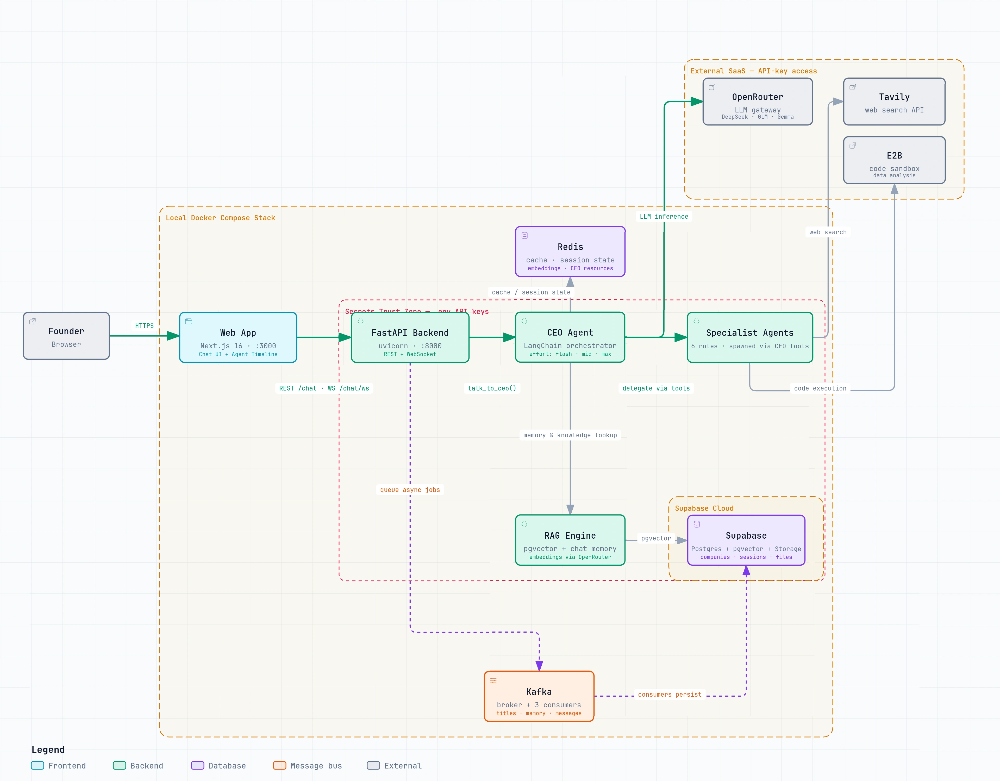
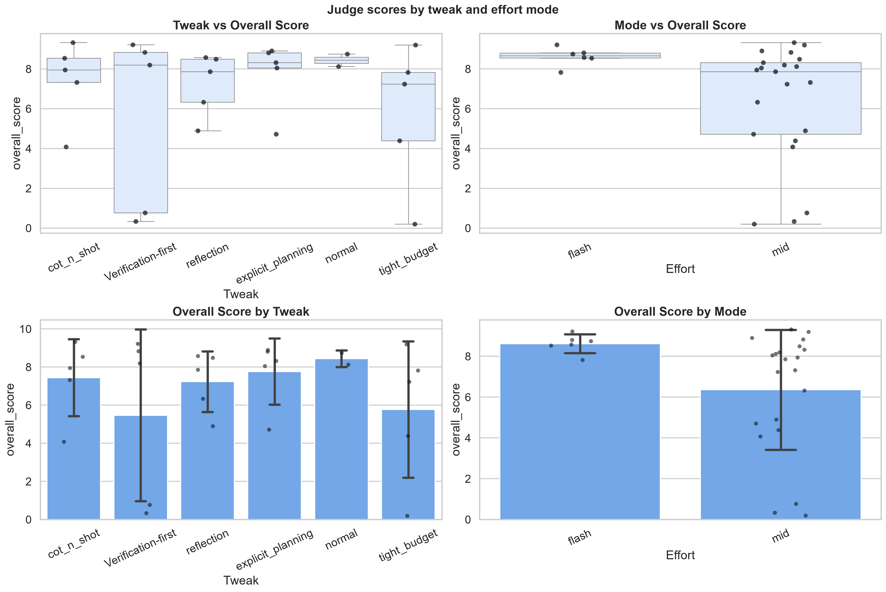
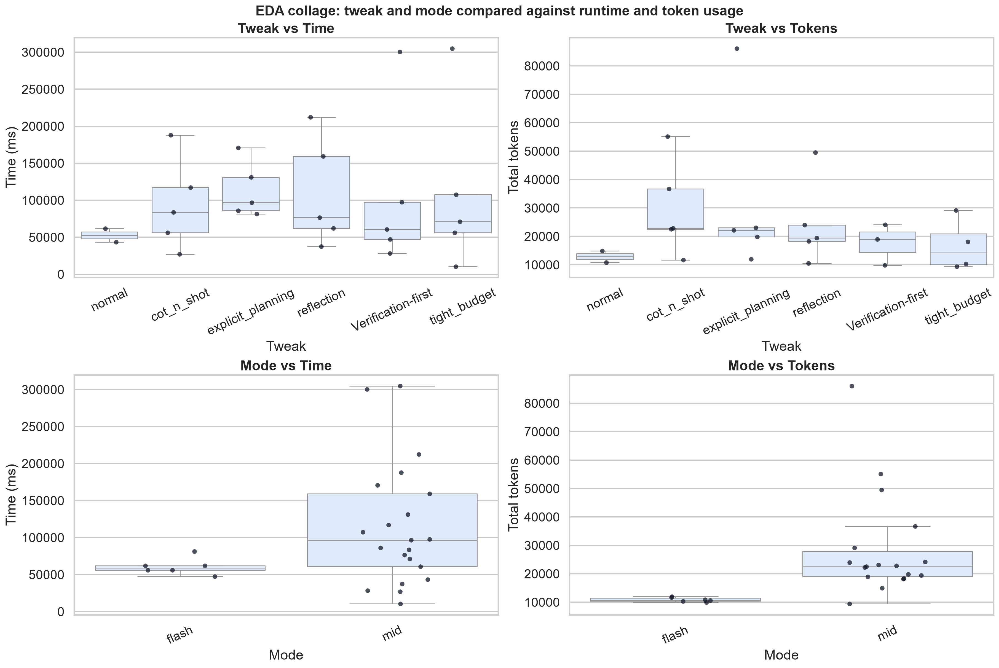

# Co_Founder — AI Co-Founder Platform v0.9.16

> **For complete system context and contributor expectations, read [`Agents_rules.md`](Agents_rules.md) before changing agent behavior.**

## Contents
- [TLDR](#tldr)
- [Overview](#overview)
- [Interviewer's Map](#interviewers-map)
- [Architecture](#architecture)
- [Evals & Benchmarks](#evals--benchmarks)
- [Performance Improvements](#performance-improvements)
- [Tech Stack](#tech-stack)
- [Agent System](#agent-system)
- [RAG Engine](#rag-engine)
- [Backend](#backend)
- [Credits & Billing](#credits--billing)
- [Frontend](#frontend)
- [Code Sandbox](#code-sandbox)
- [Prompt System & Tool Registry](#prompt-system--tool-registry)
- [Logging & Observability](#logging--observability)
- [Status](#status)

## TLDR

Co_Founder is a full-stack AI co-founder app: a founder chats with a CEO agent, and that CEO delegates work to specialist agents for research, writing, marketing, data analysis, graphic design, judging, memory, and session titles.

The important bits:
- **Product:** conversational startup assistant with onboarding, chat, file upload, dashboard, billing, and a polished landing page.
- **AI system:** LangChain CEO orchestrator, shared RAG over company documents, chat memory retrieval, effort modes, sub-agent delegation, MCQ clarification cards, and LLM-as-judge refinement.
- **Backend:** FastAPI, Supabase Postgres/pgvector, Redis caching, Kafka background jobs, e2b sandbox execution, Google OAuth, Argon2id password hashing, and signed cookie sessions.
- **Frontend:** Next.js 16, React 19, Tailwind v4, live agent trace UI, streaming answer bubble, billing page, and cinematic landing experience.
- **Billing:** live Razorpay Standard Checkout with ₹100 minimum top-up, HMAC-SHA256 verification, authoritative `order.fetch`, Redis idempotency, company credits, and invoice-style payment history.
- **Observability:** buffered WebSocket trace replay fixed the production race where agent traces could disappear; CEO responses now stream token-by-token through `agent.stream()`.
- **Benchmarks:** latest RAG benchmark: 95.00% pass rate, 0.950 Average Recall@5, 0.883 Average MRR. CEO e2e eval: 27 runs / 81 judge verdicts; `normal` prompt + `flash` mode currently leads at 8.62 overall.

## Overview

AI Co-Founder is a multi-agent platform that simulates an early founding team around a CEO orchestrator. A founder describes the business through chat; the CEO decides whether to answer directly, ask a clarification question, retrieve company knowledge, or delegate to a specialist agent.

This v0.9.16 production test includes the complete Dockerized stack, async Kafka persistence, effort-based routing, **buffered WebSocket observability with real-time LLM streaming**, Argon2id password hashing, Google OAuth + cookie session auth, env-driven CORS/rate limiting, and **live Razorpay billing**. Credits are modeled as `1 credit == ₹1`, backed by `company_credits`, `payment_history`, Redis caching, and payment idempotency. The app is usable end-to-end, with known gaps documented in [Status](#status).

## Interviewer's Map

If you are reviewing this project, these are the engineering decisions worth looking at first:

- **Agent orchestration:** `agents/CEO/CEO.py` and `agents/CEO/ceo_agent_tools.py` show how one CEO agent routes to specialist agents while preserving tool-based reasoning.
- **Retrieval quality:** `RAG_Engine/` combines semantic search, keyword search, fusion, reranking, document chunks, and separate chat-memory retrieval.
- **Streaming observability:** `backend/api/connection_manager.py`, `backend/api/observability_events.py`, `frontend/src/lib/observability.ts`, and `frontend/src/components/AgentTracePanel.tsx` solve the production race between `POST /chat` and WebSocket connection startup.
- **Async product behavior:** `backend/kafka_jobs/` moves chat message persistence, memory extraction, and title generation out of the request path.
- **Real billing path:** `backend/api/payments.py`, `backend/db/credits.py`, `backend/db/payment_history.py`, and `frontend/src/app/(app)/billing/page.tsx` cover checkout, verification, idempotency, balance updates, and invoice history.
- **Evaluation culture:** `evals/`, [Evals & Benchmarks](#evals--benchmarks), and [`docs/eval_report.md`](docs/eval_report.md) capture both the RAG numbers and CEO e2e judge results, including limitations and confounders.

## Architecture



## Evals & Benchmarks

End-to-end quality benchmarking of the **CEO agent** lives in `evals/e2e/` (`run_ceo_e2e.py` harness, `run_judging.py` judging). Latest run: **27 runs / 81 judge verdicts**. Full write-up: [`docs/eval_report.md`](docs/eval_report.md).

### What was tested

| Factor | Values |
|---|---|
| Tasks | 5 — `CEO_008` (easy · sales), `CEO_016` (mid · writing), `CEO_024` (mid · sales), `CEO_033` (hard · marketing), `CEO_045` (hard · sales) |
| Prompt tweaks | `normal`, `cot_n_shot`, `explicit_planning`, `reflection`, `Verification-first`, `tight_budget` |
| Effort modes | ⚡ `flash` (6 runs) · ⚖️ `mid` (21 runs) |
| Judges | 3 independent LLMs per run (DeepSeek v4 flash, Qwen 3.7 flash, GPT-5.6) |
| Metrics | `tool_call`, `trajectory`, `final_answer`, `constraint_adherence`, `groundedness`, `hallucination`, `overall` (0–10, averaged across judges) |

### What we found

- **`normal` prompt is the best tweak** (overall 8.44) — the reasoning scaffolds (`explicit_planning` 7.76, `cot_n_shot` 7.44, `reflection` 7.23) don't beat the default; `tight_budget` (5.77) and `Verification-first` (5.47) trail.
- **`flash` scored higher than `mid` (8.62 vs 6.36) at ~3× fewer tokens and ~half the latency** — but all 6 `flash` runs were on the *easy* task (`CEO_008`), so the gap is partly **confounded with task difficulty**; `flash` on harder tasks is untested.
- **`Verification-first` is the most hallucination-safe (8.93) but the least capable (5.47)** — it blocks unverifiable claims at the cost of task completion.
- **Groundedness is the weakest metric (6.10)** — judges can't verify claims because tool outputs aren't retained in the recorded trace.
- **Reliability:** 24/27 runs ok; 2 timeouts + 1 provider error, all on `mid`-effort hard tasks.

### Plots

| Judge scores by tweak & mode | Runtime & token usage |
|---|---|
|  |  |

## Performance Improvements

### Effort-Based Execution

Every chat request accepts an `effort` parameter (⚡ Flash / ⚖️ Mid / 🎯 Max) that controls the entire agent pipeline:

| Aspect | ⚡ Flash | ⚖️ Mid | 🎯 Max |
|--------|---------|--------|-------|
| CEO model | DeepSeek | GLM (tool-use) | GLM (tool-use) |
| Researcher reflections | 0 | 1 | 2 |
| Writer reflections | 0 | 1 | 2 |
| Writing/Creative model | DeepSeek | DeepSeek | GPT_OSS 120b |
| Classification model | MIMO 20b | MIMO 20b | MIMO 20b |
| Chat memory generation | ✅ async via Kafka | ✅ async via Kafka | ✅ async via Kafka |
| Title generation | ✅ async via Kafka | ✅ async via Kafka | ✅ async via Kafka |
| Expected latency | ~30-60s | ~2-4min | ~5-7min |

**Frontend**: Dropdown selector in the chat input bar — no text input needed. Defaults to Flash for fastest responses.

**Model selection** is handled by `get_best_llm(tasks, effort)` in `agents/helpers/choose_llm.py`. Each effort level maps task combinations to the optimal OpenRouter model based on actual model capabilities.

### Model Selection Strategy

| Model | Role | Best For |
|-------|------|----------|
| `deepseek/deepseek-v4-flash` | Default + Flash | Very fast, 1M context, excellent perf |
| `z-ai/glm-4.5-air` | Max tool-use agents | Strong tool-use, agents & coding |
| `openai/gpt-oss-120b` | Max writing/creative | High-end reasoning, best quality |
| `openai/gpt-oss-20b` | Classification | Small reasoning model |
| `google/gemma-4-26b-a4b-it` | OCR | General reasoning, multimodal, MoE |
| `morph/morph-v3-fast` | Reserved | File-editing engine — not a general LLM |
| `qwen/qwen3-coder-next` | Reserved | Defined in `choose_llm.py`, not yet routed |
| `bytedance-seed/seedream-4.5` | Reserved | Image generation, not yet routed |

### Redis & Agent Caching (v0.8.1, extended v0.9.5)

| Cache | Key Pattern | TTL | Location |
|-------|------------|-----|----------|
| Company data | `company:{id}` | 1h | `backend/db/get_from_sql.py` |
| User→Company mapping | `user:{id}` | 24h | `backend/db/get_from_sql.py` |
| Chat sessions list | `chat_sessions:{id}` | 2min | `backend/db/get_from_sql.py` |
| Session messages | `session_msgs:{id}` | 30s | `backend/db/get_from_sql.py` |
| Embeddings | `embedding:{sha256}` | 1h | `RAG_Engine/embeddings.py` |
| CEO agent instance | In-memory `(company_id, effort)` | ∞ | `agents/CEO/CEO.py` |
| **CEO request state** | `ceo_req:{uuid}` | 5min | `agents/CEO/ceo_state.py` ✨ |
| **Session resources** | `session_resources:{id}` | 1h | `agents/CEO/ceo_resources.py` |
| **Company credits** | `company_credits:{id}` | 60s | `backend/db/credits.py:23` |
| **Razorpay idempotency** | `razorpay_paid:{payment_id}` | 24h | `backend/api/payments.py:45` |

### Measured Impact

| Metric | Before | After | Improvement |
|--------|--------|-------|-------------|
| Dashboard page (typical) | ~3-4s | ~1s | **~70% ⬆** |
| Dashboard page (worst Supabase) | ~15s | ~2s | **~87% ⬆** |
| Session messages (repeat view) | 1-8s | ~0ms | **~100% ⬆** |
| `get_company_id(user)` | 0.5-1s DB | ~0ms Redis | **100% ⬆** |
| `get_chat_sessions(company)` | ~1s DB | ~0ms Redis | **100% ⬆** |
| Embedding generation (repeat) | ~500ms API | ~0ms Redis | **100% ⬆** |
| CEO agent rebuild (repeat) | ~2s | 0ms memory | **100% ⬆** |
| Startup (all agents) | 3-6s/worker | 3-6s/worker | *(lazy-load pending)* |

### Agent Routing Fix

"What is my best selling product of all time" was misrouted to Researcher (web search) instead of Data Analyst (CSV analysis on uploaded files). Added an explicit **AGENT ROUTING GUIDE** in the CEO system prompt with per-agent "USE FOR" examples, anti-patterns, and priority-ordered routing rules.

```
Before: "best selling product" → Researcher → web search → no results
After:  "best selling product" → Data Analyst → reads CSV → actual data answer
```

## Tech Stack

| Layer | Technology |
|---|---|
| Orchestration | Python 3.13+, LangChain (`create_agent` factory) |
| Backend | FastAPI, Uvicorn |
| Caching | Redis (company data, user→company mapping, sessions, messages, embeddings, CEO state, session resources, company credits, Razorpay idempotency) |
| Message Bus | Apache Kafka (KRaft, Confluent 7.8.9) + `confluent_kafka` (fire-and-forget background jobs) |
| Vector Search | Supabase pgvector (cosine similarity + keyword fusion) |
| LLM Provider | OpenRouter (DeepSeek, GLM, GPT-OSS 120b/20b, Gemma, Morph, text-embedding-3-small) |
| Web Search | Tavily Search API |
| Market Data | SerpAPI (Google Trends, Google News, Google Shopping) |
| Code Sandbox | e2b (e2b-code-interpreter) |
| PDF Extraction | PyMuPDF (fitz) |
| OCR | Vision LLM (Gemma 4 26B via OpenRouter) |
| Database | Supabase PostgreSQL + pgvector (HNSW indexes) |
| Storage | Supabase Storage (S3-compatible) |
| Payments | Razorpay Standard Checkout (`razorpay` SDK, HMAC-SHA256 verify, live keys) |
| Frontend | Next.js 16.2.9, React 19.2.4, Tailwind CSS v4 |
| UI Animation | framer-motion 12.42.0, GSAP 3.15.0, Lenis, Three.js 0.185 (React Three Fiber, drei, postprocessing) |
| Icons | lucide-react 1.21.0 |
| Markdown | react-markdown 10.1.0, remark-gfm 4.0.1 |

## Agent System

### CEO Orchestrator
The CEO (`agents/CEO/CEO.py`) is a LangChain agent built with the stock `create_agent()` factory (`from langchain.agents import create_agent`). It is initialized with:
- **System prompt**: A detailed persona describing the CEO's role, decision-making style, and constraint rules (flash effort swaps in a dedicated compact prompt, `get_ceo_system_prompt_flash`)
- **Tool registry**: 8 tools that the CEO dynamically selects via LLM reasoning (all defined in `agents/CEO/ceo_agent_tools.py`)
- **LLM backend**: OpenRouter with effort-based model selection via `get_best_llm(tasks, effort)` — picks DeepSeek, GLM, GPT-OSS, Gemma, or MIMO based on task type and effort level (flash/mid/max)
- **Streaming (v0.9.15)**: `_invoke_agent()` (`agents/CEO/CEO.py:111`) uses `agent.stream(stream_mode=["messages","updates"])` when a `session_id` is present — batches `AIMessageChunk` deltas into `llm_token` WS events (24 tokens / 60ms) and reconstructs the final `{"messages": [...]}` from `updates` so MCQ/image flows stay compatible. Falls back to `invoke()` on stream error or when called without a session (evals/CLI).

**CEO tool registry** (8 tools):

| Tool | Description |
|---|---|
| `view_all_agents` | Lists available sub-agents from `agents/agents.json` |
| `ask_mcq_for_user` | Presents MCQ clarification cards to the user |
| `knowledge_request` | Queries RAG engine for company documents (no chat memories) |
| `research_request` | Delegates to Researcher agent |
| `writing_request` | Delegates to Writer agent for content generation |
| `marketing_request` | Delegates to CMO Marketing agent |
| `data_analysis_request` | Delegates to Data Analyst with file references |
| `graphic_design_request` | Delegates to Graphic Designer agent |

**Decision loop**:
1. User message received via `POST /chat`
2. CEO plans next actions (research, write, analyze, or clarify)
3. Delegates to sub-agents via tool calls
4. Synthesizes results into a coherent response
5. Sends response back as markdown or MCQ cards

### Sub-Agent Architecture
Each sub-agent follows a common pattern:
- **Specialized system prompt** with domain expertise
- **Judge Agent reflection loop**: Effort-based — flash: 0 reflections, mid: 1, max: 2. Output scored 0–10; if below threshold (7 for researcher, 8 for writer), agent revises with Judge's critique
- **Temperature**: all agents use the default temperature 1.0 in `agents/helpers/CreateLLM.py` (no per-agent temperature tuning)

| Agent | File | Tools / Backend | Judge Loop |
|---|---|---|---|
| Researcher | `agents/researcher/researcher.py` | Tavily web search API | ✅ effort-based |
| Writer | `agents/util_agents/writer/writer.py` | Direct LLM generation | ✅ effort-based |
| CMO Marketing | `agents/marketing/cmo.py` | SerpAPI (Trends, News, Shopping) + web search | ❌ |
| Data Analyst | `agents/data_analyst/data_agent.py` | e2b code sandbox (Python, Pandas, Matplotlib) | ❌ (direct execution) |
| Graphic Designer | `agents/graphic_design/graphic_designer.py` | OpenRouter `google/gemini-2.5-flash-image`, color palette tools | ❌ (direct generation) |
| Judge | `agents/judge/llm_as_judge.py` | LLM-as-Judge prompt (GPT-OSS-120B) | N/A (evaluator) |
| Chat Memory | `agents/util_agents/chat_memory_creator.py` | Structured memory extraction from conversations | ❌ |
| Doc Description | `agents/util_agents/description_genrator.py` | LLM for document summarization | ❌ |
| Image Description | `agents/util_agents/image_description.py` | Vision LLM (Gemma) for image OCR/description | ❌ |
| Title Creator | `agents/util_agents/title_creator.py` | LLM chat session title generation | ❌ |

### Interactive MCQ Clarifications
The CEO uses the `ask_mcq_for_user` tool to present **multiple-choice question cards** in the chat UI. Implementation details:
- `agents/CEO/ceo_agent_tools.py` defines the tool with a structured JSON payload: `{type: "clarification_request", question, options, allow_custom, multi_select}`
- The tool description and CEO prompt instruct asking **at most 2 questions total per task** — a programmatic `[SYSTEM DIRECTIVE]` guard in `backend/api/chat.py` enforces effort-based limits (flash: 1, mid: 2, max: 3) and forces execution when exceeded
- Frontend renders MCQ cards via `frontend/src/components/Chat.tsx` — displays as interactive cards with checkboxes, a custom answer input, and a confirm button
- On confirmation, the raw answer (not a verbose wrapper) is sent to the backend, keeping LLM context clean
- **Critical fix (v0.8.0):** DB columns use `message` not `content`. `talk_to_ceo` now reads `turn.get("content") or turn.get("message")` — without this, ALL conversation history was silently dropped and the CEO had zero context (`agents/CEO/CEO.py:141`).

## RAG Engine

The RAG pipeline (`RAG_Engine/rag.py`) is the shared knowledge layer. Data flow:

### Ingestion Pipeline
```
User uploads file → POST /upload
  → PyMuPDF extraction (PDFs) / vision-LLM OCR (Gemma, for images)
  → Description Agent generates a retrieval-optimized summary
  → LangChain SemanticChunker (langchain_experimental) splits text by semantic boundaries
  → OpenRouter text-embedding-3-small generates 1536-dim vectors
  → Supabase direct table inserts into document_chunks (content, embedding, metadata)
  → File stored in Supabase Storage
```

### Retrieval Pipeline
```
User asks question in chat:
  → Chat memories are retrieved FIRST and injected into the user prompt (skipped in flash mode)
  → CEO calls knowledge_request tool (documents only, no chat memories)
  → Embed query with text-embedding-3-small
  → Sequential RPC calls (shared httpx client):
      • semantic_search(query_embedding, p_company_id, match_count)
      • keyword_search(query_text, p_company_id, match_count)
  → Fusion: semantic (weight 0.7) + keyword (weight 0.3)
  → Merge, deduplicate, rerank by combined score
  → Return top-k document results to CEO context
```

**Chat memory is retrieved separately** — not inside `knowledge_request` — to avoid duplication and reduce RPC overhead. The `match_chat_memories` RPC function (`schemas/match_chat_memories.sql`) performs vector similarity search over `chat_memories` using pgvector's `<=>` cosine distance operator. A local cosine-similarity fallback handles cases where the RPC is unavailable.

### Database Schema (`schemas/`)
- `users.sql`, `companies.sql`, `chat_sessions.sql`, `chat_messages.sql`, `chat_memeories.sql`, `color_palettes.sql`, `files.sql`, `document_chunks.sql` — table definitions with HNSW indexes on embedding columns
- `semantic_search.sql`, `keyword_search.sql`, `search_chat_memory.sql` — PostgreSQL RPC functions for pgvector similarity and keyword search
- `match_chat_memories.sql` — pgvector RPC for chat memory similarity (added v0.8.0)
- `company_credits.sql` — `company_credits` table (`company_id` PK, `credits numeric(18,4)`, `created_at`/`updated_at`) — 1 credit == ₹1
- `payment_history.sql` — `payment_history` table (id, company_id FK, amount, status `pending|completed|failed|refunded`, payment_date, created_at) — invoice history for billing
- `migrations/create_payment_history.sql` — idempotent migration (`CREATE TABLE IF NOT EXISTS` + `company_id, payment_date DESC` index)

## Backend

### Structure
```
Co_Founder/
├── main.py                  # Chat entry point: chat()
├── logger_config.py         # RotatingFileHandler (10MB × 3), dual handlers
├── docker-compose.yaml      # Kafka broker (KRaft, single node, port 9092)
├── requirements.txt         # includes razorpay, confluent_kafka
├── agents/                  # Agent implementations (repo root)
│   ├── agents.json          # Central agent registry (10 agents)
│   ├── CEO/                 # CEO orchestrator (CEO.py with _invoke_agent streaming, ceo_prompts.py, ceo_agent_tools.py, ceo_resources.py, ceo_state.py)
│   ├── researcher/          # Web research agent
│   ├── marketing/           # CMO marketing agent
│   ├── data_analyst/        # Data analysis + e2b sandbox
│   ├── graphic_design/      # Image generation agent
│   ├── judge/               # LLM-as-Judge evaluator
│   ├── util_agents/         # Chat memory, title, description, image description, writer agents
│   └── helpers/             # LLM selection, datetime, utilities
├── backend/
│   ├── app.py               # FastAPI app, CORS, router registration (auth/user/drive/chat/credits/payments/payment_history)
│   ├── models.py            # SQLAlchemy models
│   ├── utils.py             # Supabase client init, helpers
│   ├── security.py          # Argon2id hashing + HMAC session cookies
│   ├── api/
│   │   ├── auth.py          # /auth/signup, /auth/login, /auth/google, /auth/me, /auth/logout
│   │   ├── chat.py          # POST /chat, session CRUD, WS /chat/ws, MCQ guard
│   │   ├── user.py          # /user/onboarding, /user/dashboard, /user/files, /user/profile
│   │   ├── drive.py         # POST /upload, DELETE /file/{id}
│   │   ├── credits.py       # POST /credits/add, GET /credits/{company_id}
│   │   ├── payments.py      # POST /payments/create-order, POST /payments/verify-payment (Razorpay)
│   │   ├── payment_history.py  # CRUD /payment-history (list/create/update/delete)
│   │   ├── connection_manager.py    # ConnectionManager + SessionEventBus (buffered replay, WS traces)
│   │   └── observability_events.py  # Agent trace event types/factories (incl. llm_token)
│   ├── kafka_jobs/          # Async Kafka pipeline (producers + consumers)
│   │   ├── producers/producer.py   # queue_session_message, queue_chat_memory, queue_title_creation
│   │   ├── consumers/               # add_message_to_session_job, chat_memory_job, session_title_creation_job
│   │   └── run_consumers.py         # Launches all three consumers as subprocesses
│   └── db/
│       ├── database.py      # SQLAlchemy engine
│       ├── chat_memory_helpers.py  # store_chat_memory / store_chat_title (importable without agent stack)
│       ├── get_from_sql.py  # Supabase read queries (Redis-cached)
│       ├── insert_to_sql.py # Supabase write queries
│       ├── delete_from_sql.py
│       ├── put_to_drive.py  # Supabase Storage uploads
│       ├── credits.py       # company_credits CRUD + Redis cache (60s) + add/deduct with quantize
│       ├── payment_history.py  # payment_history CRUD (create/list/count/get/update/delete)
│       └── redis_client.py  # Redis client singleton
├── credits_engine/          # get_usage / get_total_usage pricing (MARKUP 2×, USD_INR 100, 1 credit = ₹1)
│   ├── Get_model_price.py
│   └── usage.py
├── RAG_Engine/              # rag.py, chat_memory.py, retrive.py, embeddings.py, chunking.py
├── e2b_sandbox/             # Secure Python code execution sandbox
├── connectors/              # BaseConnector abstraction (connect/disconnect/get_status)
├── evals/                   # Per-agent test scripts + e2e CEO harness
└── schemas/                 # Raw SQL migration files (incl. company_credits.sql, payment_history.sql)
```

### API Endpoints
| Method | Path | Description |
|---|---|---|
| POST | `/auth/signup` | Create user (Argon2id-hashed password) |
| POST | `/auth/login` | Authenticate user (returns id + email + onboarding_complete, sets `cofounder_session` cookie) |
| POST | `/auth/google` | Google OAuth sign-in — verifies a Supabase access token, finds/creates the app user, returns id + email + `is_new` |
| GET | `/auth/me` | Restore session from `cofounder_session` cookie |
| POST | `/auth/logout` | Clear session cookie |
| POST | `/user/onboarding` | Create company profile (name, description, industry, tone, user name) |
| GET | `/user/dashboard` | Fetch company + dashboard details |
| GET | `/user/profile` | Fetch user + company profile |
| PUT | `/user/profile` | Update company profile fields |
| POST | `/upload` | Upload file (PDF, image, CSV, Excel, JSON, Parquet) |
| GET | `/user/files` | List company files |
| GET | `/user/files/{id}/download` | Download/view a file |
| DELETE | `/file/{file_id}` | Delete file |
| POST | `/chat` | Send message to CEO agent (auto-creates session if `session_id` omitted, `effort` flash/mid/max) |
| GET | `/chat/sessions` | List user's chat sessions |
| GET | `/chat/sessions/{session_id}` | Get messages for a session |
| DELETE | `/chat/sessions/{session_id}` | Delete chat session |
| WS | `/chat/ws?session_id=` | Real-time agent trace events (`tool_start/end`, `subagent_spawn/end`, `llm_token` streaming, `heartbeat`, `session_start/end`) — buffered replay ensures no lost events in prod |
| POST | `/credits/add` | Add credits to a company (1 credit = ₹1) |
| GET | `/credits/{company_id}` | Get current credit balance |
| POST | `/payments/create-order` | Create a Razorpay order — body `{user_id?, company_id, amount (INR), currency}` — min ₹100 (10000 paise), currencies INR/USD/EUR/AED/GBP, returns `{order_id, amount (paise), currency}` |
| POST | `/payments/verify-payment` | Verify Razorpay HMAC-SHA256 signature + idempotency guard + authoritative `order.fetch` — credits on success, records `payment_history`, duplicate returns `{status:"paid", duplicate:true}` |
| GET | `/payment-history` | List payment history — query `company_id, limit (1-200), offset, status?` — returns `{payments, total, limit, offset}` |
| POST | `/payment-history` | Create a payment_history row — body `{company_id, amount, status?, payment_date?}` |
| GET | `/payment-history/{payment_id}` | Fetch a single payment row |
| PATCH | `/payment-history/{payment_id}` | Update status (`pending|completed|failed|refunded`) |
| DELETE | `/payment-history/{payment_id}` | Delete a payment row |

### Async Kafka Pipeline

Background work (chat memory extraction, session titles, message persistence) is decoupled from the request path via **fire-and-forget Kafka jobs** — the request handler produces the message (non-blocking, ~0ms) and returns immediately without waiting for consumers; failures never block or fail the chat response:

```
POST /chat
  → chat_with_user() queues to Kafka (fire-and-forget, ~0ms)
      • chat_memory              → chat_memory_job.py           → store_chat_memory()
      • session_title_creation   → session_title_creation_job.py → store_chat_title()
      • add_message_to_session   → add_message_to_session_job.py → add_message_to_session()
  → consumers run as separate processes (python backend/kafka_jobs/run_consumers.py)
```

- **Fire-and-forget semantics**: producers produce + `flush()` per message and return; there is no acknowledgement back to the request path. Each consumer isolates per-message failures with try/except — a failed job is logged and skipped, and since the offset is only committed after success, uncommitted messages are redelivered on restart (at-least-once delivery)

- **Producer**: `backend/kafka_jobs/producers/producer.py` — lazy singleton `confluent_kafka.Producer` (localhost:9092); JSON payloads produced + flushed per message
- **Consumers**: one process per topic (`backend/kafka_jobs/consumers/`), each with its own consumer group, per-message try/except isolation, and synchronous offset commits after success (`auto.offset.reset=earliest`)
- **`chat_memory_helpers.py`** — `store_chat_memory()` / `store_chat_title()` extracted from `main.py` so consumers can import them without pulling in the agent stack (CEO, LLM clients)
- **Broker**: `docker-compose.yaml` runs Confluent Kafka 7.8.9 in KRaft mode (single node, controller combined), port 9092
- MCQ replies are persisted to the DB directly (so they are visible in history immediately) and side-queued to Kafka for downstream jobs
- Chat memory extraction and title generation now run for **all effort levels** (previously skipped in flash mode) — asynchronously, so they never block the response

### Authentication Flow
- On success, user metadata (id, email) is returned — `company_id` is not included
- Backend sets `httpOnly` `cofounder_session` (HMAC-signed, `SESSION_SECRET`, `SESSION_MAX_AGE_DAYS`, `SESSION_COOKIE_SECURE`) — `GET /auth/me` restores it; `POST /auth/logout` clears it; `localStorage` keeps a non-httpOnly mirror for the UI
- Client may still send `user_id` as a query/form param as a fallback (verified against the cookie when present)
- No per-request JWT verification on most protected endpoints — they trust `user_id` when no cookie is present (known gap, see [Status](#status))

#### Google OAuth (Supabase Auth)
- Frontend uses `@supabase/supabase-js` (PKCE flow): `signInWithOAuth({ provider: "google" })` → Google → Supabase Auth → redirect back to `/auth/callback`
- `/auth/callback` sends ONLY the Supabase access token to `POST /auth/google`
- The backend verifies the token with Supabase Auth (`auth.get_user(jwt)`) and uses the **verified** identity (never a client-supplied email/name). It then finds or creates the matching `public.users` row:
  - Existing row with `auth_provider = 'google'` → login (matched by `supabase_user_id`, falling back to email)
  - New identity → create row with `password = NULL`, `name` from Google metadata, `auth_provider = 'google'`, `supabase_user_id = <Supabase UUID>`
  - Email already used by an email/password account → `409` (no silent account merge)
- Returns the same shape as `/auth/login` (`{id, email, message}`) plus `is_new`; the frontend then saves the session and redirects to `/chat`
- Required env vars:
  - Frontend (`NEXT_PUBLIC_*`, inlined at build time, read from the **repo-root `.env`** via `frontend/scripts/run-next.js` — no separate `frontend/.env.local` needed): `NEXT_PUBLIC_SUPABASE_URL`, `NEXT_PUBLIC_SUPABASE_ANON_KEY`, optional `NEXT_PUBLIC_AUTH_REDIRECT_URL`, plus `NEXT_PUBLIC_RAZORPAY_KEY_ID` for checkout
  - Backend (root `.env`, already used by the REST layer): `SUPABASE_URL`, `SUPABASE_SERVICE_ROLE_KEY`, `RAZORPAY_KEY_ID`, `RAZORPAY_KEY_SECRET`, `SESSION_SECRET`, `SESSION_COOKIE_SECURE`, `SESSION_MAX_AGE_DAYS`
  - Configure the OAuth redirect URL in Supabase → Authentication → URL Configuration (e.g. `http://localhost:3000/auth/callback`)
- Database: `public.users` gains `supabase_user_id uuid` (nullable, unique) — see `schemas/migrations/add_supabase_user_id.sql`

#### Password Hashing
- Passwords are **hashed with Argon2id** (`pwdlib[argon2]`, `backend/security.py`) — plaintext is never stored; legacy plaintext rows are transparently rehashed on login (best-effort)
- **Fail-closed**: empty/missing hashes never authenticate; login/signup are rate-limited (10/min per IP)
- `UserCreate` enforces `EmailStr` + 8–128 char passwords; `LoginRequest` stays permissive for legacy accounts

## Credits & Billing

Credits are the product's currency: **1 credit == ₹1 of selling value**. The CEO agent's token usage is priced per model, marked up, and charged in INR. Payments are collected via **Razorpay Standard Checkout** — the frontend never sees `RAZORPAY_KEY_SECRET`.

### Pricing Engine (`credits_engine/usage.py:18`)

```python
get_usage(model, input_tokens, output_tokens, image_count=0)
get_total_usage(usage_list, no_of_images=0)  # sums across models
```

- `get_model_price(model, is_image_model)` (`credits_engine/Get_model_price.py`) returns per-1M input/output USD rates (and image pricing for `x-ai/grok-imagine-image-2.0` at $0.04/image).
- `MARKUP = 2`, `USD_INR = 100` (`credits_engine/usage.py:8`) — i.e. 2× over raw LLM cost, $1 = ₹100 for the selling price.
- Returns `credits = selling_price_inr = total_cost_usd * 2 * 100`. Multi-model requests are summed in `get_total_usage()` (`credits_engine/usage.py:82`) with per-model breakdown and graceful skipping of unpriceable models.

### Company Balance (`backend/db/credits.py:1`)

Table `company_credits` (`schemas/company_credits.sql:1`): `company_id` PK FK → `companies`, `credits numeric(18,4) >=0`, `created_at`/`updated_at`. Helpers:

- `create_company_credits`, `get_company_credits` (Redis-cached 60s, `company_credits:{id}`), `update_company_credits`, `add_credits` (creates row at 0 if missing), `deduct_credits` (raises `InsufficientCreditsError`, handles `23514` race), `delete_company_credits` — all with quantized `Decimal("0.0001")` and `invalidate` on write.
- Balance read: `GET /credits/{company_id}` (`backend/api/credits.py:31`) — returns `{company_id, balance}`.
- Top-up (internal): `POST /credits/add` — called by the payments flow, not directly from the billing UI anymore.

### Razorpay Checkout (`backend/api/payments.py:1`)

**Flow**

1. Frontend `POST /payments/create-order` with `{company_id, user_id?, amount (INR), currency="INR"}` → backend `_resolve_user` (cookie preferred, fallback `user_id`, else 401) + `_require_company` (403 if not owned) → validates currency in `{"INR","USD","EUR","AED","GBP"}` and `amount_paise >= 10000` (₹100) (`backend/api/payments.py:41`) → `razorpay.Client.order.create({amount: paise, currency, receipt: "credit_{company_id}_{ts}"})` → returns `{order_id, amount, currency}`.
2. Browser opens `https://checkout.razorpay.com/v1/checkout.js` (injected once via `loadRazorpayCheckoutScript()` in `frontend/src/app/(app)/billing/page.tsx:68`) — keyed only by public `NEXT_PUBLIC_RAZORPAY_KEY_ID` (`RAZORPAY_KEY_ID` live `rzp_live_TWK3IQpepNq9B8` in `.env`).
3. On success, frontend `POST /payments/verify-payment` with `{company_id, user_id?, razorpay_payment_id, razorpay_order_id, razorpay_signature}` → backend verifies `HMAC-SHA256(order_id|payment_id, RAZORPAY_KEY_SECRET)` with `hmac.compare_digest` (`backend/api/payments.py:177`) → on mismatch records a `failed` `payment_history` row and returns 400; on match checks Redis idempotency `razorpay_paid:{payment_id}` (`nx=True`, 86400s) — duplicate returns `{status:"paid", duplicate:true, balance}` without double-crediting; otherwise `order.fetch(order_id)` for the **authoritative** paise amount, `add_credits(company_id, amount_inr)`, and `create_payment_history(company_id, amount_inr, status="completed")`.

- `RAZORPAY_KEY_SECRET` (`3eN5V0zGlNtVK1QrRvJJYhBR` in `.env` — rotate before sharing) **never leaves the backend** (`backend/api/payments.py:15`); env vars are `RAZORPAY_KEY_ID`, `RAZORPAY_KEY_SECRET` (backend) and `NEXT_PUBLIC_RAZORPAY_KEY_ID` (frontend).
- `frontend/src/lib/api.ts:124` exposes `createRazorpayOrder` / `verifyRazorpayPayment` / `fetchPaymentHistory` / `fetchCreditBalance` used by the billing page.

### Payment History (`backend/db/payment_history.py:1`, `backend/api/payment_history.py:1`)

Table `payment_history` (`schemas/payment_history.sql:1` / `schemas/migrations/create_payment_history.sql:1`): `id` identity PK, `company_id` FK cascade, `amount numeric(18,4) >=0`, `status in ('pending','completed','failed','refunded')`, `payment_date` + `created_at` (defaults `now()`), index on `(company_id, payment_date DESC)`.

- DB helpers: `create_payment_history`, `get_payment_history(limit 1-200, offset, status?)`, `count_payment_history`, `get_payment_history_by_id`, `update_payment_history_status`, `delete_payment_history` — all via Supabase client (`backend/utils.py`), with status/amount validation.
- API (`backend/app.py:18`): `GET /payment-history?company_id&limit&offset&status`, `POST /payment-history`, `GET /payment-history/{id}`, `PATCH /payment-history/{id}` (`{status}`), `DELETE /payment-history/{id}` — auth mirrors payments (cookie preferred, fallback `user_id`).

## Frontend

Frontend is a Next.js app with the main user flows in `frontend/src/app/` and shared chat/agent UI in `frontend/src/components/`. The important bits are the chat experience, onboarding, dashboard, drive, billing, and observability views plus a cinematic marketing landing.

### Billing (`frontend/src/app/(app)/billing/page.tsx:1`)

- **Header** with Live badge and INR/USD toggle (pill, `bg-[#0a0a0a]` active) + live FX display (`1 USD ≈ ₹… • live`).
- **FX fetching** (`frontend/src/app/(app)/billing/page.tsx:173`): `frankfurter.app` → `exchangerate-api.com` → `jsdelivr @fawazahmed0/currency-api` fallback, fallback 83, refreshed hourly via `setInterval`.
- **Stats strip** (3 cards): Available balance (hero card with gradient, `Coins`, `formatINR`/`formatUSD`, secondary approx), Total purchased (lifetime completed sum, `TrendingUp`, progress bar to 5000), Invoices (total count + completed/failed split, `History`, scrolls to `#invoice-history`).
- **Buy credits** card: preset chips `[100,250,500,1000,2500]` (`frontend/src/app/(app)/billing/page.tsx:135`) with active state (`bg-[#0a0a0a]` + check), custom amount input with `₹`/`$` prefix, `below min` guard (₹100 / `MIN_AMOUNT` `frontend/src/app/(app)/billing/page.tsx:136`), dual-currency conversion (`rawAmount * usdInrRate`), approx badge, and trust footer.
- **Order summary** rail (sticky on `lg`): Credits / Amount / Approx USD-INR / Total due today / New balance (`bg-[#eef2ff]`), primary CTA `Pay ₹…` (`btn-accent`, disabled until `canCheckout`, `CreditCard` icon, `Loader2` while `processing`), `ondismiss` → `Checkout cancelled`, `payment.failed` handler surfaces `error.description`.
- **Razorpay wiring**: `loadRazorpayCheckoutScript()` (`frontend/src/app/(app)/billing/page.tsx:68`) lazy-loads `checkout.js`, `new Razorpay({key, amount: order.amount (paise), currency, name:"Co-Founder", description, order_id, prefill:{name,email}, theme:{color:"#4f46e5"}, handler, modal:{ondismiss}})` (`frontend/src/app/(app)/billing/page.tsx:315`), then `verifyRazorpayPayment` → success/duplicate notice (`CheckCircle2`), reset `customAmount`, reload balance/history, dispatch `window.dispatchEvent(new Event("cofounder:credits-updated"))` for the sidebar badge; failures reload balance and show error.
- **Invoice history** (`#invoice-history`): `ReceiptText` heading, `historyLoading` spinner, empty state (icon + "No payments yet"), else bordered table (`Date | Invoice type | Status | Cost`) with `STATUS_META` badges (`completed` emerald, `pending` amber, `failed` red, `refunded` zinc), formatted `formatDate` + dual-currency cost, plus bottom trust strip.

### Landing (`frontend/src/app/page.tsx:1`)

`LandingThemeProvider` + `Cursor` + `Nav` + `main.bg-[var(--color-bg)]` with absolute `bg-grid` backdrop (`opacity-[0.42]`) + sequential folds separated by `SectionBridge`:

```tsx
Hero
<SectionBridge variant="comet"  label="meet your team" />
Dashboard
<SectionBridge variant="aurora" label="under the hood" />
HowItThinks
<SectionBridge variant="orbit"  label="the difference" />
Comparison
<SectionBridge variant="comet"  label="capabilities" />
Features
<SectionBridge variant="aurora" label="extend it" />
Plugins
<SectionBridge variant="orbit"  label="simple pricing" />
Pricing
CTA
```

- **`Nav`** (`frontend/src/components/landing/Nav.tsx:1`) — fixed pill header (max 1440px), scroll-aware shadow (`scrolled` → larger shadow), wordmark with `icon.png`, center links (`Platform`/`Agents`/`Use Cases`/`Pricing`/`Resources`) in `bg-[#f3f1ea]` pill (desktop), `Login` + CTA on the right, mobile drawer.
- **`SectionBridge`** (`frontend/src/components/landing/SectionBridge.tsx:1`) — three variants: `comet` (glowing comet glides across a static hairline), `aurora` (shimmer band), `orbit` (orbiting dot) — GSAP `ScrollTrigger` `scrub:0.9`, twinkling stars (`bridge-star`), edge blends, mono label (`tracking-[0.32em]`), respects `prefers-reduced-motion`.
- **`Hero`** (`frontend/src/components/landing/Hero.tsx:1`), **`Dashboard`** (`frontend/src/components/landing/Dashboard.tsx:1`), **`HowItThinks`** (`frontend/src/components/landing/HowItThinks.tsx:1`), **`Comparison`** (`frontend/src/components/landing/Comparison.tsx:1`), **`Features`** (`frontend/src/components/landing/Features.tsx:1`), **`Plugins`** (`frontend/src/components/landing/Plugins.tsx:1` — hub-and-spoke integrations: Instagram, Google Ads, Meta, Google Sheets, Shopify, Razorpay + more, connector lines with flowing dots, responsive grid below `lg`), **`Pricing`** (`frontend/src/components/landing/Pricing.tsx:1`), **`CTA`** (`frontend/src/components/landing/CTA.tsx:1`) — editorial layout, `Instrument_Serif` headlines, `JetBrains_Mono` labels.
- **`landing.css`** (`frontend/src/app/landing.css:1`) — cream/forest theme (`--color-accent #163a24`, `--color-bg #fdfcf8`, light/dark `[data-theme]`), `bg-grid`, noise overlay (`frontend/src/app/page.tsx:23`).
- **`layout.tsx`** (`frontend/src/app/layout.tsx:1`) — `next/font/google` `Inter` + `Instrument_Serif` (`--font-display-serif`) + `JetBrains_Mono` (`--font-mono`), all `display:swap`, applied to `<html>` class.
- `Demo` (`frontend/src/components/landing/Demo.tsx`) was removed from the landing flow; the file remains for reference.
- Public brand SVGs: `google-sheets.svg`, `google_ads-icon.svg`, `instagram.svg`, `meta.svg`, `shopify.svg`, `razorpay-mark.svg`/`razorpay.svg`, plus `bg.png`.

**v0.9.15 — chat trace & streaming:**
- `frontend/src/components/Chat.tsx:422` — chat container owns the session, effort selector, message list, and the **live streaming answer bubble** (`streamingText` + `llmActive` from `useObservability`). `sendToBackend` pre-generates the `sessionId`, calls `startQuery(sid)` + `await waitForConnection(sid)` *before* `POST /chat`, then snapshots `runs` via `snapshotRuns()` for the response. Typing indicator and streaming bubble render under `sending`.
- `frontend/src/components/AgentTracePanel.tsx:57` — trace dropdown anchored **beside the chat bar** (right-aligned popover above the input). Auto-opens on send, displays connection badge, live tool calls with `TraceRow` (`frontend/src/components/AgentTimeline.tsx:51`), subagent durations, streaming response preview, and a clear button. Closes on outside click. Replaces the old inline `AgentTraceInline` that rendered under each assistant message.
- `frontend/src/lib/observability.ts:129` — `useObservability(sessionId)` manages the persistent WS (`/chat/ws`), groups raw events into `ToolRun`s (keyed by `tool_run_id`), handles `llm_token` accumulation (cleared on next `tool_start`), auto-reconnect with exponential backoff, and per-session isolation.

If you need the exact frontend structure, inspect the `frontend/` workspace directly.

## Code Sandbox

The Data Analyst agent uses **e2b** (`agents/data_analyst/data_agent.py` + `e2b_sandbox/codig_env.py`) for secure Python execution:

1. Agent receives file references from the CEO
2. Files are downloaded from Supabase Storage
3. Uploaded into an e2b sandbox instance
4. Agent generates a Python script (Pandas, Matplotlib, seaborn)
5. Script executes in the sandbox; stdout/stderr and any generated plot images are captured
6. Results are formatted into an executive summary with key findings, visualizations, and actionable recommendations
7. Sandbox is automatically torn down to prevent resource leaks

## Prompt System & Tool Registry

### CEO Tool Definitions
All 8 CEO tools are defined in `agents/CEO/ceo_agent_tools.py` (see the [CEO tool registry table](#ceo-orchestrator)). Sub-agent tools live alongside their agents:
- Researcher: `agents/researcher/researcher_agent_tools.py`
- Writer: `agents/util_agents/writer/writer_agent_tools.py`
- CMO: `agents/marketing/cmo_tools.py`
- Data Analyst: `agents/data_analyst/data_analyst_tools.py`
- Graphic Designer: `agents/graphic_design/graphic_desiger_tools.py`
- Helpers: `agents/helpers/` (serp_helpers, coding_agent_tools, CreateLLM)

`agents/agents.json` is the central registry mirroring the agents and their tools (10 agent entries).

### Prompt Engineering
All agent prompts follow a structured format:
- **Persona definition**: Role, expertise, tone, constraints
- **Tool descriptions**: Name, parameters, usage guidelines, and examples
- **Output formatting rules**: Markdown structure, required sections, length limits
- **Quality constraints**: Judge review threshold (≥ 8/10 for writer, ≥ 7/10 for researcher), revision instructions
- **Edge case handling**: Missing information, ambiguous requests, error recovery

Each agent prompt is defined as a module-level constant (e.g., `RESEARCHER_SYSTEM_PROMPT`, `WRITER_SYSTEM_PROMPT`) in the respective agent file.

## Logging & Observability

- **`logger_config.py`**: Dual-handler setup
  - `RotatingFileHandler`: 10 MB per file, 3 backup copies, DEBUG+ level
  - `StreamHandler`: Console output at INFO+ level
- Logs capture: agent decisions, tool calls, RAG queries, API requests/responses, file operations, sandbox execution, errors/warnings
- All agents and tools use `logger.info()` / `logger.debug()` / `logger.error()` with consistent format: `[timestamp] [LEVEL] module: message`
- Log file location: `logs.log` in project root

### WebSocket Agent Trace (v0.9.15 — buffered + real-time LLM streaming)

Real-time observability streamed to the frontend via WebSocket (`WS /chat/ws?session_id=` in `backend/app.py`).

**Backend — `SessionEventBus` (`backend/api/connection_manager.py:107`)**
- **Buffered replay** (prod fix): events pushed before the browser's WebSocket finishes upgrading are kept in a per-session replay buffer (`_buffers`, bounded to 1500 entries) and replayed into the next `drain()` loop. `event_bus.begin_query(session_id)` (`backend/api/chat.py:134`) clears stale buffers at the start of each query so the trace maps 1:1 to the current request.
- **Missed sentinel handling**: `send_sentinel()` records a `_pending_sentinel` flag when no drain loop is listening; a late-connecting `drain()` replays the buffer then immediately ends instead of blocking forever.
- **Fan-out**: each `drain()` call owns its own `asyncio.Queue`; events are fanned out to all active drains. Queues are cleaned up on exit; offsets are not involved (in-memory only).
- **Event types** (`backend/api/observability_events.py:24`): `tool_start` / `tool_end` / `tool_error`, `subagent_spawn` / `subagent_end` / `subagent_error`, **`llm_token`** / `llm_start` / `llm_end`, `session_start` / `session_end`, `heartbeat`, `error`.

**Agent streaming — `agents/CEO/CEO.py:94`**
- `talk_to_ceo` now calls `_invoke_agent()` which uses LangChain `agent.stream(..., stream_mode=["messages","updates"])` instead of `invoke()`.
- `messages` channel → `AIMessageChunk` token deltas batched at ~24 tokens / 60ms (`_TOKEN_BATCH_SIZE` / `_TOKEN_FLUSH_SECONDS`) and pushed as `llm_token` events via `event_bus.push(make_llm_token(...))`.
- `updates` channel → `{node: {messages: [...]}}` accumulated to reconstruct the full `{"messages": [...]}` result so MCQ (`clarification_request`) and `image_generated` flows are unchanged. Stream failures flush buffered tokens and fall back to `agent.invoke()`; eval/CLI calls with no `session_id` bypass streaming entirely.

**Frontend — `useObservability` (`frontend/src/lib/observability.ts:129`) + `AgentTracePanel` (`frontend/src/components/AgentTracePanel.tsx:1`)**
- `useObservability` maintains one persistent WS per session (`wsUrl` → `API_BASE_URL` + `/chat/ws`). State: `runs` (grouped `ToolRun`s), `streamingText` / `llmActive` (live answer), `connectionStatus` (`disconnected`/`connecting`/`connected`), `streamEnded`, `retryCount`.
- **Guaranteed connect before chat**: `Chat.tsx:544` calls `await waitForConnection(sid)` (polls up to 8s, auto-reopens) *before* `POST /chat` — combined with the server-side buffer this eliminates the "invisible trace" race. `startQuery(sid)` resets `runs`/`streamingText` per query without tearing down the WS.
- **Token handling**: `llm_token` appends to `streamingText`; the next `tool_start` clears it so planning/"thinking" tokens never appear as the final answer. `session_end` clears `llmActive`.
- **`AgentTracePanel`**: dropdown anchored beside the chat bar (right-aligned popover above the input, `AgentTracePanel.tsx:121`). Auto-opens on send, shows connection badge (Live/Connected/Connecting/Offline), live tool calls via `TraceRow` (`AgentTimeline.tsx:51`), subagent durations, expandable inputs/outputs, live streaming response block, and a clear button (`resetRuns`). The old inline `AgentTraceInline` under each message was removed — per-message `traceRuns` snapshot is still taken via `snapshotRuns()` but no longer rendered inline.
- **Resilience**: `onclose` exponential backoff (up to 5 retries); session switch tears down the old WS; `resetRuns` clears display without touching the socket.

**Per-query isolation**: trace resets at each new query (`begin_query` server-side + `startQuery` client-side); `snapshotRuns()` captures the current `runs` snapshot for optional message attachment. Trace survives page reload via persisted message state.

## Status

Functional end-to-end production test release (v0.9.16). The core chat loop, multi-agent system, RAG pipeline, file management, **buffered WebSocket observability with live LLM streaming**, effort-based execution, Kafka async jobs, onboarding flow, Argon2id password hashing, Google OAuth, cookie-based session auth, and **live Razorpay billing (₹100 minimum, payment_history invoices, INR/USD)** are operational. v0.9.15 fixed the production-only invisible trace and added token-by-token answer streaming; v0.9.16 ships the money path and a reworked landing/billing shell. Known gaps:
- Image generation uses OpenRouter `google/gemini-2.5-flash-image`; slow (~30s) and blocks the CEO pipeline
- Supabase free tier REST API adds 3-7s latency per RPC call (embedding serialization overhead)
- The session cookie restores login on the next visit, but protected endpoints still trust the `user_id` query param when no cookie is present (no per-request JWT verification beyond `verify_session_token` in payments/payment-history)
- Razorpay live keys are currently in `.env` in the repo — rotate before public deploy

## License

Copyright (C) 2026 Karthikeya Kumar

This project is licensed under the GNU Affero General Public License v3.0 (AGPL-3.0).

See the LICENSE file for details.

## Final Skim

Co_Founder is a production-test multi-agent SaaS app with a Next.js frontend, FastAPI backend, Supabase pgvector RAG, Redis caching, Kafka async jobs, e2b code execution, live WebSocket agent tracing, Google/email auth, and Razorpay billing. The strongest parts to review are the CEO orchestration loop, RAG pipeline, streaming observability fix, async persistence, billing verification, and evaluation suite. The main caveat is still security hardening: some protected endpoints trust `user_id` when no httpOnly cookie is present.
