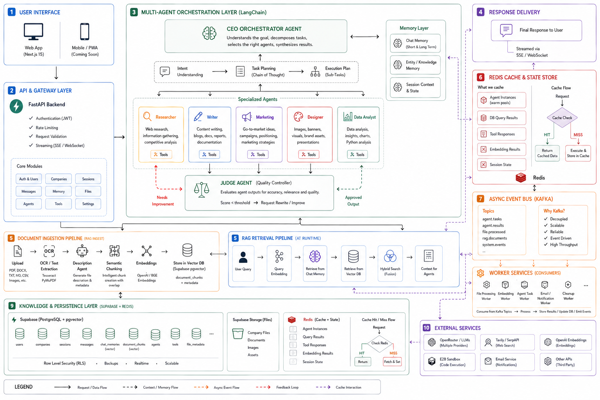

# Co_Founder — v0.9.11 (Prerelease)

> **📘 For complete system context and understanding, please refer to [`Agents_rules.md`](Agents_rules.md) before contributing or making changes.**


## Contents

- [Overview](#overview)
- [Architecture](#architecture)
- [Tech Stack](#tech-stack)
- [Agent System](#agent-system)
- [RAG Engine](#rag-engine)
- [Backend](#backend)
- [Frontend](#frontend)
- [Code Sandbox](#code-sandbox)
- [Prompt System & Tool Registry](#prompt-system--tool-registry)
- [Logging & Observability](#logging--observability)
- [Setup](#setup)
- [Performance Improvements](#performance-improvements)
- [Status](#status)
- [Contributing](#contributing)

## License

Copyright (C) 2026 Karthikeya Kumar

This project is licensed under the GNU Affero General Public License v3.0 (AGPL-3.0).

See the LICENSE file for details.

## Overview

AI Co-Founder is a multi-agent AI platform that replaces a human founding team with a CEO orchestrator agent and specialized sub-agents. Founders describe their business idea through a conversational chat interface, and the agents collaboratively handle strategy, market research, content writing, data analysis, and knowledge management via a shared RAG + chat memory backbone.

## Architecture



## Tech Stack

| Layer | Technology |
|---|---|
| Orchestration | Python 3.13+, LangChain (`create_agent` factory) |
| Backend | FastAPI, Uvicorn |
| Caching | Redis (company data, user→company mapping, sessions, messages, embeddings, CEO state, session resources) |
| Message Bus | Apache Kafka (KRaft, Confluent 7.8.9) + `confluent_kafka` (fire-and-forget background jobs) |
| Vector Search | Supabase pgvector (cosine similarity + keyword fusion) |
| LLM Provider | OpenRouter (DeepSeek, GLM, GPT-OSS 120b/20b, Gemma, Morph, text-embedding-3-small) |
| Web Search | Tavily Search API |
| Market Data | SerpAPI (Google Trends, Google News, Google Shopping) |
| Code Sandbox | e2b (e2b-code-interpreter) |
| PDF Extraction | PyMuPDF (fitz) |
| OCR | Vision LLM (Gemma 4 26B via OpenRouter) |
| Database | Supabase PostgreSQL + pgvector (HNSW indexes) |
| Storage | Supabase Storage (S3-compatible) |
| Frontend | Next.js 16.2.9, React 19.2.4, Tailwind CSS v4 |
| UI Animation | framer-motion 12.42.0, GSAP 3.15.0, Lenis, Three.js 0.185 (React Three Fiber, drei, postprocessing) |
| Icons | lucide-react 1.21.0 |
| Markdown | react-markdown 10.1.0, remark-gfm 4.0.1 |

## Agent System

### CEO Orchestrator
The CEO (`agents/CEO/CEO.py`) is a LangChain agent built with the stock `create_agent()` factory (`from langchain.agents import create_agent`). It is initialized with:
- **System prompt**: A detailed persona describing the CEO's role, decision-making style, and constraint rules (flash effort swaps in a dedicated compact prompt, `get_ceo_system_prompt_flash`)
- **Tool registry**: 8 tools that the CEO dynamically selects via LLM reasoning (all defined in `agents/CEO/ceo_agent_tools.py`)
- **LLM backend**: OpenRouter with effort-based model selection via `get_best_llm(tasks, effort)` — picks DeepSeek, GLM, GPT-OSS, Gemma, or MIMO based on task type and effort level (flash/mid/max)

**CEO tool registry** (8 tools):

| Tool | Description |
|---|---|
| `view_all_agents` | Lists available sub-agents from `agents/agents.json` |
| `ask_mcq_for_user` | Presents MCQ clarification cards to the user |
| `knowledge_request` | Queries RAG engine for company documents (no chat memories) |
| `research_request` | Delegates to Researcher agent |
| `writing_request` | Delegates to Writer agent for content generation |
| `marketing_request` | Delegates to CMO Marketing agent |
| `data_analysis_request` | Delegates to Data Analyst with file references |
| `graphic_design_request` | Delegates to Graphic Designer agent |

**Decision loop**:
1. User message received via `POST /chat`
2. CEO plans next actions (research, write, analyze, or clarify)
3. Delegates to sub-agents via tool calls
4. Synthesizes results into a coherent response
5. Sends response back as markdown or MCQ cards

### Sub-Agent Architecture
Each sub-agent follows a common pattern:
- **Specialized system prompt** with domain expertise
- **Judge Agent reflection loop**: Effort-based — flash: 0 reflections, mid: 1, max: 2. Output scored 0–10; if below threshold (7 for researcher, 8 for writer), agent revises with Judge's critique
- **Temperature**: all agents use the default temperature 1.0 in `agents/helpers/CreateLLM.py` (no per-agent temperature tuning)

| Agent | File | Tools / Backend | Judge Loop |
|---|---|---|---|
| Researcher | `agents/researcher/researcher.py` | Tavily web search API | ✅ effort-based |
| Writer | `agents/util_agents/writer/writer.py` | Direct LLM generation | ✅ effort-based |
| CMO Marketing | `agents/marketing/cmo.py` | SerpAPI (Trends, News, Shopping) + web search | ❌ |
| Data Analyst | `agents/data_analyst/data_agent.py` | e2b code sandbox (Python, Pandas, Matplotlib) | ❌ (direct execution) |
| Graphic Designer | `agents/graphic_design/graphic_designer.py` | OpenRouter `google/gemini-2.5-flash-image`, color palette tools | ❌ (direct generation) |
| Judge | `agents/judge/llm_as_judge.py` | LLM-as-Judge prompt (GPT-OSS-120B) | N/A (evaluator) |
| Chat Memory | `agents/util_agents/chat_memory_creator.py` | Structured memory extraction from conversations | ❌ |
| Doc Description | `agents/util_agents/description_genrator.py` | LLM for document summarization | ❌ |
| Image Description | `agents/util_agents/image_description.py` | Vision LLM (Gemma) for image OCR/description | ❌ |
| Title Creator | `agents/util_agents/title_creator.py` | LLM chat session title generation | ❌ |

### Interactive MCQ Clarifications
The CEO uses the `ask_mcq_for_user` tool to present **multiple-choice question cards** in the chat UI. Implementation details:
- `agents/CEO/ceo_agent_tools.py` defines the tool with a structured JSON payload: `{type: "clarification_request", question, options, allow_custom, multi_select}`
- The tool description and CEO prompt instruct asking **at most 2 questions total per task** — a programmatic `[SYSTEM DIRECTIVE]` guard in `backend/api/chat.py` enforces effort-based limits (flash: 1, mid: 2, max: 3) and forces execution when exceeded
- Frontend renders MCQ cards via `frontend/src/components/Chat.tsx` — displays as interactive cards with checkboxes, a custom answer input, and a confirm button
- On confirmation, the raw answer (not a verbose wrapper) is sent to the backend, keeping LLM context clean
- **Critical fix (v0.8.0):** DB columns use `message` not `content`. `talk_to_ceo` now reads `turn.get("content") or turn.get("message")` — without this, ALL conversation history was silently dropped and the CEO had zero context (`agents/CEO/CEO.py:141`).

## RAG Engine

The RAG pipeline (`RAG_Engine/rag.py`) is the shared knowledge layer. Data flow:

### Ingestion Pipeline
```
User uploads file → POST /upload
  → PyMuPDF extraction (PDFs) / vision-LLM OCR (Gemma, for images)
  → Description Agent generates a retrieval-optimized summary
  → LangChain SemanticChunker (langchain_experimental) splits text by semantic boundaries
  → OpenRouter text-embedding-3-small generates 1536-dim vectors
  → Supabase direct table inserts into document_chunks (content, embedding, metadata)
  → File stored in Supabase Storage
```

### Retrieval Pipeline
```
User asks question in chat:
  → Chat memories are retrieved FIRST and injected into the user prompt (skipped in flash mode)
  → CEO calls knowledge_request tool (documents only, no chat memories)
  → Embed query with text-embedding-3-small
  → Sequential RPC calls (shared httpx client):
      • semantic_search(query_embedding, p_company_id, match_count)
      • keyword_search(query_text, p_company_id, match_count)
  → Fusion: semantic (weight 0.7) + keyword (weight 0.3)
  → Merge, deduplicate, rerank by combined score
  → Return top-k document results to CEO context
```

**Chat memory is retrieved separately** — not inside `knowledge_request` — to avoid duplication and reduce RPC overhead. The `match_chat_memories` RPC function (`schemas/match_chat_memories.sql`) performs vector similarity search over `chat_memories` using pgvector's `<=>` cosine distance operator. A local cosine-similarity fallback handles cases where the RPC is unavailable.

### Database Schema (`schemas/`)
- `users.sql`, `companies.sql`, `chat_sessions.sql`, `chat_messages.sql`, `chat_memeories.sql`, `color_palettes.sql`, `files.sql`, `document_chunks.sql` — table definitions with HNSW indexes on embedding columns
- `semantic_search.sql`, `keyword_search.sql`, `search_chat_memory.sql` — PostgreSQL RPC functions for pgvector similarity and keyword search
- `match_chat_memories.sql` — pgvector RPC for chat memory similarity (added v0.8.0)

## Backend

### Structure
```
Co_Founder/
├── main.py                  # Chat entry point: chat()
├── logger_config.py         # RotatingFileHandler (10MB × 3), dual handlers
├── docker-compose.yaml      # Kafka broker (KRaft, single node, port 9092)
├── requirements.txt
├── agents/                  # Agent implementations (repo root)
│   ├── agents.json          # Central agent registry (10 agents)
│   ├── CEO/                 # CEO orchestrator (CEO.py, ceo_prompts.py, ceo_agent_tools.py, ceo_resources.py, ceo_state.py)
│   ├── researcher/          # Web research agent
│   ├── marketing/           # CMO marketing agent
│   ├── data_analyst/        # Data analysis + e2b sandbox
│   ├── graphic_design/      # Image generation agent
│   ├── judge/               # LLM-as-Judge evaluator
│   ├── util_agents/         # Chat memory, title, description, image description, writer agents
│   └── helpers/             # LLM selection, datetime, utilities
├── backend/
│   ├── app.py               # FastAPI app, CORS, router registration
│   ├── models.py            # SQLAlchemy models
│   ├── utils.py             # Supabase client init, helpers
│   ├── api/
│   │   ├── auth.py          # /auth/signup, /auth/login
│   │   ├── chat.py          # POST /chat, session CRUD, WS /chat/ws, MCQ guard
│   │   ├── user.py          # /user/onboarding, /user/dashboard, /user/files
│   │   ├── drive.py         # POST /upload, DELETE /file/{id}
│   │   ├── connection_manager.py    # ConnectionManager + SessionEventBus (WS traces)
│   │   └── observability_events.py  # Agent trace event types/factories
│   ├── kafka_jobs/          # Async Kafka pipeline (producers + consumers)
│   │   ├── producers/producer.py   # queue_session_message, queue_chat_memory, queue_title_creation
│   │   ├── consumers/               # add_message_to_session_job, chat_memory_job, session_title_creation_job
│   │   └── run_consumers.py         # Launches all three consumers as subprocesses
│   └── db/
│       ├── database.py      # SQLAlchemy engine
│       ├── chat_memory_helpers.py  # store_chat_memory / store_chat_title (importable without agent stack)
│       ├── get_from_sql.py  # Supabase read queries (Redis-cached)
│       ├── insert_to_sql.py # Supabase write queries
│       ├── delete_from_sql.py
│       ├── put_to_drive.py  # Supabase Storage uploads
│       └── redis_client.py  # Redis client singleton
├── RAG_Engine/              # rag.py, chat_memory.py, retrive.py, embeddings.py, chunking.py
├── e2b_sandbox/             # Secure Python code execution sandbox
├── connectors/              # BaseConnector abstraction (connect/disconnect/get_status)
├── evals/                   # Per-agent test scripts
└── schemas/                 # Raw SQL migration files
```

### API Endpoints
| Method | Path | Description |
|---|---|---|
| POST | `/auth/signup` | Create user (plaintext password) |
| POST | `/auth/login` | Authenticate user (returns id + email) |
| POST | `/user/onboarding` | Create company profile (name, description, industry, tone) |
| GET | `/user/dashboard` | Fetch company + dashboard details |
| POST | `/upload` | Upload file (PDF, image, CSV, Excel, JSON, Parquet) |
| GET | `/user/files` | List company files |
| DELETE | `/file/{file_id}` | Delete file |
| POST | `/chat` | Send message to CEO agent (auto-creates session if `session_id` omitted) |
| GET | `/chat/sessions` | List user's chat sessions |
| GET | `/chat/sessions/{session_id}` | Get messages for a session |
| DELETE | `/chat/sessions/{session_id}` | Delete chat session |
| WS | `/chat/ws?session_id=` | Real-time agent trace events (tool_start/end, subagent spawn/end, heartbeats) |

### Async Kafka Pipeline (v0.9.9)

Background work (chat memory extraction, session titles, message persistence) is decoupled from the request path via **fire-and-forget Kafka jobs** — the request handler produces the message (non-blocking, ~0ms) and returns immediately without waiting for consumers; failures never block or fail the chat response:

```
POST /chat
  → chat_with_user() queues to Kafka (fire-and-forget, ~0ms)
      • chat_memory              → chat_memory_job.py           → store_chat_memory()
      • session_title_creation   → session_title_creation_job.py → store_chat_title()
      • add_message_to_session   → add_message_to_session_job.py → add_message_to_session()
  → consumers run as separate processes (python backend/kafka_jobs/run_consumers.py)
```

- **Fire-and-forget semantics**: producers produce + `flush()` per message and return; there is no acknowledgement back to the request path. Each consumer isolates per-message failures with try/except — a failed job is logged and skipped, and since the offset is only committed after success, uncommitted messages are redelivered on restart (at-least-once delivery)

- **Producer**: `backend/kafka_jobs/producers/producer.py` — lazy singleton `confluent_kafka.Producer` (localhost:9092); JSON payloads produced + flushed per message
- **Consumers**: one process per topic (`backend/kafka_jobs/consumers/`), each with its own consumer group, per-message try/except isolation, and synchronous offset commits after success (`auto.offset.reset=earliest`)
- **`chat_memory_helpers.py`** — `store_chat_memory()` / `store_chat_title()` extracted from `main.py` so consumers can import them without pulling in the agent stack (CEO, LLM clients)
- **Broker**: `docker-compose.yaml` runs Confluent Kafka 7.8.9 in KRaft mode (single node, controller combined), port 9092
- MCQ replies are persisted to the DB directly (so they are visible in history immediately) and side-queued to Kafka for downstream jobs
- Chat memory extraction and title generation now run for **all effort levels** (previously skipped in flash mode) — asynchronously, so they never block the response

### Authentication Flow
- On success, user metadata (id, email) is returned — `company_id` is not included
- Client stores in `localStorage` and sends `user_id` as a query/form parameter
- No JWT, no HTTP-only cookies, no session expiry

#### Password Hashing (v0.9.11)
- Passwords are **hashed with Argon2id** (`pwdlib[argon2]`, `backend/security.py`) — plaintext is never stored; legacy plaintext rows are transparently rehashed on login (best-effort)
- **Fail-closed**: empty/missing hashes never authenticate; login/signup are rate-limited (10/min per IP)
- `UserCreate` enforces `EmailStr` + 8–128 char passwords; `LoginRequest` stays permissive for legacy accounts

## Frontend

### Structure
```
frontend/src/
├── app/
│   ├── layout.tsx            # Root layout
│   ├── page.tsx              # Landing page (47 lines — thin orchestrator; content lives in components/landing/)
│   ├── landing.css           # Landing page styles (357 lines)
│   ├── globals.css           # Design system tokens, cards, glass nav, animations
│   ├── auth/page.tsx         # Auth page (277 lines) — login/signup toggle, brand panel, animated transitions
│   ├── onboarding/page.tsx   # Onboarding wizard (421 lines) — 4-step form with progress bar
│   └── (app)/                # Authenticated route group
│       ├── layout.tsx        # AppShell wrapper
│       ├── dashboard/page.tsx # Dashboard (145 lines) — overview stats, recent files, quick actions
│       ├── chat/page.tsx     # Chat page (28 lines)
│       ├── drive/page.tsx    # Drive (136 lines) — file grid, upload/delete
│       ├── plugins/page.tsx  # Plugins (19 lines) — "Coming Soon"
│       ├── settings/page.tsx # Settings (82 lines) — tabbed UI, placeholder content
│       ├── profile/page.tsx  # Profile (145 lines)
│       ├── profile/settings/page.tsx
│       └── [sessionId]/page.tsx
├── components/
│   ├── AppLayout.tsx         # Collapsible sidebar, session management, chat history
│   ├── Chat.tsx              # Full chat component (896 lines) — messages, MCQ cards, typing indicator, effort selector
│   ├── AgentTimeline.tsx     # AgentTraceInline — collapsible trace below each message
│   ├── landing/              # 19 landing section components (Hero, HowItThinks, Features, Comparison, CTA…)
│   └── ui/
└── lib/
    ├── api.ts                # API client (271 lines)
    ├── observability.ts      # useObservability hook — persistent WS connection (383 lines)
    ├── session.ts            # localStorage session helpers
    └── hooks/                # useLenis, useMouse, useScramble
```

### Page Details

**Landing Page** (`/`): Animated hero with a Three.js scene (noise-shader icosahedron, neural net, particle field) animated by GSAP. `HowItThinks` shows a horizontal pinned-scroll of 7 agent cards (CEO, Researcher, Writer, CMO, Data Analyst, Graphic Designer, Judge) + an end card. Sections for solution/product surface, feature grid (6 cards), cinematic two-column comparison (cost, speed, availability, tools, coordination, memory), CTA, and footer.

**Auth Page** (`/auth`): Split layout — left brand panel with static agent chips (desktop) or stacked (mobile). Animated form toggle between login/signup. Input validation, loading spinner, error/success toasts. Redirects to `/dashboard` on login, `/onboarding` on signup.

**Onboarding Wizard** (`/onboarding`): 4 steps — company name → description (max 500 words with counter) → industry (text input) → brand tone (radio cards: Friendly/Professional/Witty). Progress bar, back/continue/finish buttons, animated transitions between steps.

**App Shell** (`/(app)`): Collapsible sidebar with 4 nav items — Overview, Chat, Drive, Plugins — plus New Chat button, recent-chats list, and a Settings link in the footer. Settings is a separate route with tabbed UI (General, Appearance, Notifications, Security, Billing) but placeholder ("Coming Soon") content; Plugins page is also a "Coming Soon" placeholder.

**Dashboard** (`/dashboard`): Overview stats cards (files, storage, sessions), recent files grid, quick action buttons. File management lives on `/drive` (file grid with type icons, upload/delete).

### Chat Component
- Renders message list with react-markdown + remark-gfm
- MCQ cards rendered as interactive HTML forms — checkboxes, custom text input, confirm button
- Typing indicator (bouncing dots animation) during agent processing
- Session management: create new, switch via sidebar, delete with confirmation dialog
- Auto-scroll to bottom on new messages
- **Copy button** — every assistant message has a hover-visible copy button (top-right). Code blocks (```text) have a dedicated copy button inside the dark block
- **Deliverable formatting** — CEO wraps emails, captions, ads in ```text blocks; frontend renders with dark background, spacing, and copy affordance
- **Effort selector** — dropdown in the chat input bar (⚡ Flash / ⚖️ Mid / 🎯 Max), defaults to Flash

### Design System (`globals.css`)
- Tailwind v4 `@theme` custom tokens for colors, fonts, spacing
- Flat card system with borders and soft shadows, hover lifts
- Glass-morphism navigation with backdrop blur
- Grid background pattern and text gradient utilities
- Custom scrollbar, keyframe animations (fade-in, slide-up, float), reduced-motion media query support

## Code Sandbox

The Data Analyst agent uses **e2b** (`agents/data_analyst/data_agent.py` + `e2b_sandbox/codig_env.py`) for secure Python execution:

1. Agent receives file references from the CEO
2. Files are downloaded from Supabase Storage
3. Uploaded into an e2b sandbox instance
4. Agent generates a Python script (Pandas, Matplotlib, seaborn)
5. Script executes in the sandbox; stdout/stderr and any generated plot images are captured
6. Results are formatted into an executive summary with key findings, visualizations, and actionable recommendations
7. Sandbox is automatically torn down to prevent resource leaks

## Prompt System & Tool Registry

### CEO Tool Definitions
All 8 CEO tools are defined in `agents/CEO/ceo_agent_tools.py` (see the [CEO tool registry table](#ceo-orchestrator)). Sub-agent tools live alongside their agents:
- Researcher: `agents/researcher/researcher_agent_tools.py`
- Writer: `agents/util_agents/writer/writer_agent_tools.py`
- CMO: `agents/marketing/cmo_tools.py`
- Data Analyst: `agents/data_analyst/data_analyst_tools.py`
- Graphic Designer: `agents/graphic_design/graphic_desiger_tools.py`
- Helpers: `agents/helpers/` (serp_helpers, coding_agent_tools, CreateLLM)

`agents/agents.json` is the central registry mirroring the agents and their tools (10 agent entries).

### Prompt Engineering
All agent prompts follow a structured format:
- **Persona definition**: Role, expertise, tone, constraints
- **Tool descriptions**: Name, parameters, usage guidelines, and examples
- **Output formatting rules**: Markdown structure, required sections, length limits
- **Quality constraints**: Judge review threshold (≥ 8/10 for writer, ≥ 7/10 for researcher), revision instructions
- **Edge case handling**: Missing information, ambiguous requests, error recovery

Each agent prompt is defined as a module-level constant (e.g., `RESEARCHER_SYSTEM_PROMPT`, `WRITER_SYSTEM_PROMPT`) in the respective agent file.

## Logging & Observability

- **`logger_config.py`**: Dual-handler setup
  - `RotatingFileHandler`: 10 MB per file, 3 backup copies, DEBUG+ level
  - `StreamHandler`: Console output at INFO+ level
- Logs capture: agent decisions, tool calls, RAG queries, API requests/responses, file operations, sandbox execution, errors/warnings
- All agents and tools use `logger.info()` / `logger.debug()` / `logger.error()` with consistent format: `[timestamp] [LEVEL] module: message`
- Log file location: `logs.log` in project root

### WebSocket Agent Trace (v0.9.5)

Real-time observability streamed to the frontend via WebSocket:

- **Backend**: `SessionEventBus` (fan-out queue per drain loop) + `ObservabilityCallback` (LangGraph callback) in `backend/api/connection_manager.py` / `observability_events.py` pushes `tool_start`, `tool_end`, `tool_error`, `subagent_spawn`, `subagent_end`, `subagent_error`, `session_start`, `session_end`, `heartbeat` events
- **Frontend**: `useObservability` hook (`frontend/src/lib/observability.ts`) maintains persistent WS connection; `AgentTraceInline` renders collapsible trace below each assistant message
- **Per-query isolation**: Trace resets at each new query; completed trace snapshotted and attached to the message; trace survives page reload (stored in message state)
- **Live streaming**: Trace appears immediately when user sends query, populates in real-time as tool calls execute
- **Connection**: Single persistent WS per session — backend `while True` loop keeps it alive across queries

## Setup

### Prerequisites
- Python 3.12+
- Node.js 20+
- Supabase project (PostgreSQL + Storage)
- API keys: Tavily, OpenRouter, SerpAPI, e2b

### Installation
1. Clone the repo
2. Install Python deps: `pip install -r requirements.txt`
3. Install frontend deps: `cd frontend && npm install`
4. Create a `.env` in the project root with: `TAVILY_API_KEY`, `DATABASE_URL` (Supabase), `LLM_API_KEY` (OpenRouter), `SERP_API_KEY`, `SUPABSE_SERVICE_ROLE_KEY`, `E2B_API_KEY`
5. Run Supabase SQL migrations from `schemas/` — create the tables, RPC functions, and HNSW indexes
6. Start Kafka: `docker compose up -d kafka` (required for chat memory/title persistence)
7. Start Kafka consumers: `python backend/kafka_jobs/run_consumers.py` (three background processes)
8. Start backend: `uvicorn backend.app:app --reload` (default: `http://localhost:8000`)
9. Start frontend: `cd frontend && npm run dev` (default: `http://localhost:3000`)

### Docker (full stack)

The whole stack — Kafka, Redis, FastAPI backend, Kafka consumers, and the Next.js
frontend — can be run with a single command:

```bash
./start_docker.sh          # build + run in foreground
./start_docker.sh -d       # build + run in the background
# or directly:
docker compose up --build
```

- Images: `Dockerfile` (Python backend + consumers) and `frontend/Dockerfile` (Next.js, `output: "standalone"`).
- Secrets come from the root `.env` file (`env_file`) — they are never baked into images. Docker-specific endpoints (`KAFKA_BOOTSTRAP_SERVERS=kafka:29092`, `REDIS_URL=redis://redis:6379/0`) are injected by `docker-compose.yaml`.
- Ports: frontend `:3000`, backend `:8000`, Kafka `:9092` (host), Redis `:6379`.
- The backend/consumers wait for Kafka & Redis to become healthy before starting.

### Deployment

The stack is containerized and can be deployed to any Docker host or PaaS
(Railway, Render, Fly.io, GCP/AWS) that supports Docker.

1. **Provision the database**: run the SQL in `schemas/` against a Supabase
   project (tables, RPC functions, HNSW indexes).
2. **Environment variables** (backend/consumers): `DATABASE_URL`,
   `LLM_API_KEY`, `TAVILY_API_KEY`, `SERP_API_KEY`, `SUPABSE_SERVICE_ROLE_KEY`,
   plus `CORS_ORIGINS` (comma-separated allowed browser origins — set to your
   frontend domain, e.g. `https://app.example.com`).
3. **Build arg** (frontend): `NEXT_PUBLIC_API_URL` must be the public backend
   URL (e.g. `https://api.example.com`). The WebSocket endpoint is derived from
   it automatically.
4. **Kafka + Redis**: either run the bundled containers or point
   `KAFKA_BOOTSTRAP_SERVERS` / `REDIS_URL` at managed instances.
5. **Reverse proxy / TLS**: put nginx or the PaaS router in front. The backend
   honours `X-Forwarded-For` for rate limiting, so forward proxy headers.
   Health endpoints: backend `/health`, frontend `/`.
6. **Rate limits** (per client IP, configurable via env):
   `/auth/*` 10/min, `/chat` 30/min (`CHAT_RATE_LIMIT_PER_MINUTE`),
   `/upload` 20/min (`UPLOAD_RATE_LIMIT_PER_MINUTE`).

> ⚠️ **Auth is demo-grade**: there is no JWT/session layer — the client passes
> `user_id` directly. Argon2id hashing and per-IP rate limiting are in place,
> but add real authentication before exposing the app to untrusted users.


## Performance Improvements

### Effort-Based Execution (v0.9.0)

Every chat request accepts an `effort` parameter (⚡ Flash / ⚖️ Mid / 🎯 Max) that controls the entire agent pipeline:

| Aspect | ⚡ Flash | ⚖️ Mid | 🎯 Max |
|--------|---------|--------|-------|
| CEO model | DeepSeek | GLM (tool-use) | GLM (tool-use) |
| Researcher reflections | 0 | 1 | 2 |
| Writer reflections | 0 | 1 | 2 |
| Writing/Creative model | DeepSeek | DeepSeek | GPT_OSS 120b |
| Classification model | MIMO 20b | MIMO 20b | MIMO 20b |
| Chat memory generation | ✅ async via Kafka | ✅ async via Kafka | ✅ async via Kafka |
| Title generation | ✅ async via Kafka | ✅ async via Kafka | ✅ async via Kafka |
| Expected latency | ~30-60s | ~2-4min | ~5-7min |

**Frontend**: Dropdown selector in the chat input bar — no text input needed. Defaults to Flash for fastest responses.

**Model selection** is handled by `get_best_llm(tasks, effort)` in `agents/helpers/choose_llm.py`. Each effort level maps task combinations to the optimal OpenRouter model based on actual model capabilities.

### Model Selection Strategy

| Model | Role | Best For |
|-------|------|----------|
| `deepseek/deepseek-v4-flash` | Default + Flash | Very fast, 1M context, excellent perf |
| `z-ai/glm-4.5-air` | Max tool-use agents | Strong tool-use, agents & coding |
| `openai/gpt-oss-120b` | Max writing/creative | High-end reasoning, best quality |
| `openai/gpt-oss-20b` | Classification | Small reasoning model |
| `google/gemma-4-26b-a4b-it` | OCR | General reasoning, multimodal, MoE |
| `morph/morph-v3-fast` | Reserved | File-editing engine — not a general LLM |
| `qwen/qwen3-coder-next` | Reserved | Defined in `choose_llm.py`, not yet routed |
| `bytedance-seed/seedream-4.5` | Reserved | Image generation, not yet routed |

### Redis & Agent Caching (v0.8.1, extended v0.9.5)

| Cache | Key Pattern | TTL | Location |
|-------|------------|-----|----------|
| Company data | `company:{id}` | 1h | `backend/db/get_from_sql.py` |
| User→Company mapping | `user:{id}` | 24h | `backend/db/get_from_sql.py` |
| Chat sessions list | `chat_sessions:{id}` | 2min | `backend/db/get_from_sql.py` |
| Session messages | `session_msgs:{id}` | 30s | `backend/db/get_from_sql.py` |
| Embeddings | `embedding:{sha256}` | 1h | `RAG_Engine/embeddings.py` |
| CEO agent instance | In-memory `(company_id, effort)` | ∞ | `agents/CEO/CEO.py` |
| **CEO request state** | `ceo_req:{uuid}` | 5min | `agents/CEO/ceo_state.py` ✨ |
| **Session resources** | `session_resources:{id}` | 1h | `agents/CEO/ceo_resources.py` |

### Measured Impact

| Metric | Before | After | Improvement |
|--------|--------|-------|-------------|
| Dashboard page (typical) | ~3-4s | ~1s | **~70% ⬆** |
| Dashboard page (worst Supabase) | ~15s | ~2s | **~87% ⬆** |
| Session messages (repeat view) | 1-8s | ~0ms | **~100% ⬆** |
| `get_company_id(user)` | 0.5-1s DB | ~0ms Redis | **100% ⬆** |
| `get_chat_sessions(company)` | ~1s DB | ~0ms Redis | **100% ⬆** |
| Embedding generation (repeat) | ~500ms API | ~0ms Redis | **100% ⬆** |
| CEO agent rebuild (repeat) | ~2s | 0ms memory | **100% ⬆** |
| Startup (all agents) | 3-6s/worker | 3-6s/worker | *(lazy-load pending)* |

### Agent Routing Fix

"What is my best selling product of all time" was misrouted to Researcher (web search) instead of Data Analyst (CSV analysis on uploaded files). Added an explicit **AGENT ROUTING GUIDE** in the CEO system prompt with per-agent "USE FOR" examples, anti-patterns, and priority-ordered routing rules.

```
Before: "best selling product" → Researcher → web search → no results
After:  "best selling product" → Data Analyst → reads CSV → actual data answer
```

## Status

Functional end-to-end prerelease (v0.9.9.11). The core chat loop, multi-agent system, RAG pipeline, file management, WebSocket observability, effort-based execution, Kafka async jobs, onboarding flow, and Argon2id password hashing are operational. Known gaps:
- Image generation uses OpenRouter `google/gemini-2.5-flash-image`; slow (~30s) and blocks the CEO pipeline
- No automated test suite — only ad-hoc eval scripts in `evals/`
- CORS is configured via the `CORS_ORIGINS` env var (defaults to localhost)
- Supabase free tier REST API adds 3-7s latency per RPC call (embedding serialization overhead)
- No JWT/session layer — the client passes `user_id` directly (demo-grade auth; rate limiting + Argon2id applied)


## Changelog (v0.9.5 → v0.9.11)

### Kafka Async Job Pipeline
- **Decoupled background work**: chat memory extraction, session title generation, and message persistence moved off FastAPI `BackgroundTasks` onto Kafka topics
- **Topics + consumers**: `chat_memory` → `chat_memory_job.py`, `session_title_creation` → `session_title_creation_job.py`, `add_message_to_session` → `add_message_to_session_job.py`
- **Producer module**: `backend/kafka_jobs/producers/producer.py` with `queue_session_message()`, `queue_chat_memory()`, `queue_title_creation()` (lazy singleton producer, JSON payloads, flush per message)
- **Consumer jobs**: one process per topic, own consumer group, per-message error isolation, synchronous offset commit after success, `auto.offset.reset=earliest`
- **`run_consumers.py`**: launches all three consumers as subprocesses from a single command
- **`chat_memory_helpers.py`**: `store_chat_memory()` / `store_chat_title()` extracted from `main.py` so consumers can import persistence without the agent stack (CEO, LLM clients)
- **`main.py` slimmed** to the `chat()` entry point only
- **`docker-compose.yaml`**: Confluent Kafka 7.8.9 single-node KRaft broker on port 9092
- **MCQ persistence**: clarification replies are written to the DB directly (immediately visible in history) and side-queued to Kafka
- **All efforts get memory/titles**: flash mode no longer skips chat memory extraction or title generation — they run async via Kafka, so the response path is unaffected
- **`connectors/base.py`**: `BaseConnector` abstraction (`connect` / `disconnect` / `get_status`) added as the foundation for pluggable external connectors
- **`requirements.txt`**: added `confluent_kafka`

### Agent Registry & Routing Updates
- CEO tools in `agents/agents.json` expanded: `ask_mcq_for_user`, `research_request`, `writing_request`, `marketing_request` with agent-routing descriptions (e.g. `data_analysis_request` explicitly scoped to company files; `knowledge_request` documents only)
- CMO `super_search` renamed to `search_current_market_trends`; CMO gained `get_current_date`

### Flash Response Optimizations
- Dedicated compact flash CEO prompt (`get_ceo_system_prompt_flash`) with explicit resource limits and a "one agent does research AND write" directive
- Flash latency improved ~40% via reduced model hops and skipped non-essential pipeline stages

### Resource Guard Rails
- Session resource budget (`agents/CEO/ceo_resources.py`) enforced for `external_agents`, `web_searches`, `rag_calls`, `mcqs` (flash: 1/2/1/1, mid: 2/3/3/2, max: 5/4/5/3)
- Exhausted resources return explicit errors; agents must synthesize from collected data instead of retrying
