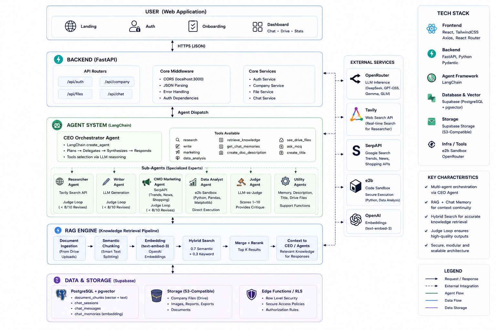

# Co_Founder — v0.8.0 (Prerelease)

> **📘 For complete system context and understanding, please refer to [`Agents_rules.md`](Agents_rules.md) before contributing or making changes.**
>
> **📋 Changes since v0.7.2:** [See changelog below](#changelog-v072--v080)

## Contents

- [Overview](#overview)
- [Architecture](#architecture)
- [Agent System](#agent-system)
- [RAG Engine](#rag-engine)
- [Backend](#backend)
- [Frontend](#frontend)
- [Code Sandbox](#code-sandbox)
- [Prompt System & Tool Registry](#prompt-system--tool-registry)
- [Logging & Observability](#logging--observability)
- [Tech Stack](#tech-stack)
- [Setup](#setup)
- [Status](#status)
- [Contributing](#contributing)

## Overview

AI Co-Founder is a multi-agent AI platform that replaces a human founding team with a CEO orchestrator agent and specialized sub-agents. Founders describe their business idea through a conversational chat interface, and the agents collaboratively handle strategy, market research, content writing, data analysis, and knowledge management via a shared RAG + chat memory backbone.

## Architecture



## Agent System

### CEO Orchestrator
The CEO (`backend/agents/ceo_agent.py`) is a LangChain agent built with `create_agent()` — a custom wrapper around LangChain's agent framework. It is initialized with:
- **System prompt**: A detailed persona describing the CEO's role, decision-making style, and constraint rules
- **Tool registry**: 10+ tools that the CEO dynamically selects via LLM reasoning
- **LLM backend**: OpenRouter with model selection via `get_best_llm(system_prompt)` — picks DeepSeek, GPT-OSS, Gemma, or GLM based on context

**Decision loop**:
1. User message received via `POST /api/chat`
2. CEO plans next actions (research, write, analyze, or clarify)
3. Delegates to sub-agents via tool calls
4. Synthesizes results into a coherent response
5. Sends response back as markdown or MCQ cards

### Sub-Agent Architecture
Each sub-agent follows a common pattern:
- **Specialized system prompt** with domain expertise
- **Judge Agent reflection loop**: Output is scored 1–10; if < 8/10, the agent revises with Judge's critique
- **Temperature 0.7** for creative tasks (writer), **0.2** for analytical (data analyst)

| Agent | File | Tools / Backend | Judge Loop |
|---|---|---|---|
| Researcher | `agents/researcher/researcher.py` | Tavily web search API | ✅ < 7/10 revises |
| Writer | `agents/util_agents/writer/writer.py` | Direct LLM generation | ✅ < 8/10 revises |
| CMO Marketing | `agents/marketing/cmo.py` | SerpAPI (Trends, News, Shopping) + web search | ✅ < 8/10 revises |
| Data Analyst | `agents/data_analyst/data_agent.py` | e2b code sandbox (Python, Pandas, Matplotlib) | ❌ (direct execution) |
| Graphic Designer | `agents/graphic_design/graphic_designer.py` | OpenRouter `google/gemini-2.5-flash-image`, color palette tools | ❌ (direct generation) |
| Judge | `agents/judge/llm_as_judge.py` | LLM-as-Judge prompt (GPT-OSS-120B) | N/A (evaluator) |
| Chat Memory | `agents/util_agents/chat_memory_creator.py` | Structured memory extraction from conversations | ❌ |
| Doc Description | `agents/util_agents/description_genrator.py` | LLM + OCR for document/image summarization | ❌ |
| Title Creator | `agents/util_agents/title_creator.py` | LLM chat session title generation | ❌ |

### Interactive MCQ Clarifications
The CEO uses the `ask_mcq_for_user` tool to present **multiple-choice question cards** in the chat UI. Implementation details:
- `agents/CEO/ceo_agent_tools.py` defines the tool with a structured JSON payload: question text, options list, multi_select flag, allow_custom flag
- The CEO agent is instructed to ask **at most 2 questions total per task** — exceeding this triggers a programmatic `[SYSTEM DIRECTIVE]` guard in `backend/api/chat.py` that forces execution
- Frontend renders MCQ cards via `Chat.tsx` — displays as interactive cards with checkboxes, a custom answer input, and a confirm button
- On confirmation, the raw answer (not a verbose wrapper) is sent to the backend, keeping LLM context clean
- **Critical fix (v0.8.0):** DB columns use `message` not `content`. `talk_to_ceo` now reads `turn.get("content") or turn.get("message")` — without this, ALL conversation history was silently dropped and the CEO had zero context.

## RAG Engine

The RAG pipeline (`backend/RAG_Engine/rag.py`) is the shared knowledge layer. Data flow:

### Ingestion Pipeline
```
User uploads file → POST /api/files/upload
  → PyMuPDF extraction (PDFs) / OCR (images)
  → Description Agent generates a retrieval-optimized summary
  → LangChain SemanticChunker splits text by semantic boundaries
  → OpenRouter text-embedding-3-small generates 1536-dim vectors
  → Supabase pgvector RPC inserts (content, embedding, metadata)
  → File stored in Supabase Storage
```

### Retrieval Pipeline
```
User asks question in chat:
  → Chat memories are retrieved FIRST and injected into the user prompt
  → CEO calls knowledge_request tool (documents only, no chat memories)
  → Embed query with text-embedding-3-small
  → Sequential RPC calls (shared httpx client):
      • semantic_search(query_embedding, p_company_id, match_count)
      • keyword_search(query_text, p_company_id, match_count)
  → Fusion: semantic (weight 0.7) + keyword (weight 0.3)
  → Merge, deduplicate, rerank by combined score
  → Return top-k document results to CEO context
```

**Chat memory is retrieved separately** — not inside `knowledge_request` — to avoid duplication and reduce RPC overhead. The `match_chat_memories` RPC function (`schemas/match_chat_memories.sql`) performs vector similarity search over `chat_memories` using pgvector's `<=>` cosine distance operator. A local cosine-similarity fallback handles cases where the RPC is unavailable.

### Database Schema (`schemas/`)
- `users.sql`, `companies.sql`, `chat_sessions.sql`, `chat_messages.sql`, `chat_memeories.sql`, `color_palettes.sql`, `files.sql`, `document_chunks.sql` — table definitions with HNSW indexes on embedding columns
- `semantic_search.sql`, `keyword_search.sql`, `search_chat_memory.sql` — PostgreSQL RPC functions for pgvector similarity and keyword search
- `match_chat_memories.sql` — pgvector RPC for chat memory similarity (added v0.8.0)

## Backend

### Structure
```
├── main.py                  # Chat entry point: chat(), store_chat_memory(), store_chat_title()
├── logger_config.py         # RotatingFileHandler (10MB × 3), dual handlers
├── backend/
│   ├── app.py               # FastAPI app, CORS, router registration
│   ├── models.py            # SQLAlchemy models
│   ├── utils.py             # Supabase client init, helpers
│   ├── api/
│   │   ├── auth.py          # Auth routes
│   │   ├── chat.py          # POST /chat, session CRUD, MCQ guard
│   │   ├── user.py          # User routes
│   │   └── drive.py         # File upload/download routes
│   └── db/
│       ├── database.py      # SQLAlchemy engine
│       ├── get_from_sql.py  # Supabase read queries
│       ├── insert_to_sql.py # Supabase write queries
│       ├── delete_from_sql.py
│       └── put_to_drive.py  # Supabase Storage uploads
├── agents/                  # Agent implementations
│   ├── agents.json          # Central agent registry
│   ├── CEO/                 # CEO orchestrator (CEO.py, ceo_prompts.py, ceo_agent_tools.py)
│   ├── researcher/          # Web research agent
│   ├── marketing/           # CMO marketing agent
│   ├── data_analyst/        # Data analysis + e2b sandbox
│   ├── graphic_design/      # Image generation agent
│   ├── judge/               # LLM-as-Judge evaluator
│   ├── util_agents/         # Chat memory, title, description, writer agents
│   └── helpers/             # LLM selection, datetime, utilities
├── RAG_Engine/              # rag.py, chat_memory.py, retrive.py, embeddings.py, chunking.py
├── e2b_sandbox/             # Secure Python code execution sandbox
├── evals/                   # Per-agent test scripts
└── schemas/                 # Raw SQL migration files
```

### API Endpoints
| Method | Path | Description |
|---|---|---|
| POST | `/signup` | Create user (plaintext password) |
| POST | `/login` | Authenticate user |
| POST | `/onboard-company` | Create company profile (name, description, industry, tone) |
| GET | `/company` | Fetch company details |
| POST | `/api/files/upload` | Upload file (PDF, image, CSV, Excel, JSON, Parquet) |
| GET | `/api/files/list-files` | List company files |
| DELETE | `/api/files/delete-file` | Delete file |
| POST | `/api/chat` | Send message to CEO agent |
| POST | `/api/chat/new` | Create new chat session |
| GET | `/api/chat/list` | List user's chat sessions |
| GET | `/api/chat/{id}/messages` | Get messages for a session |
| DELETE | `/api/chat/{id}` | Delete chat session |

### Authentication Flow
- Password stored in database as plaintext (no hashing)
- On login, `authenticate_user()` compares raw strings
- On success, user metadata (id, email, company_id) is returned
- Client stores in `localStorage` and sends `user_id` as a query/form parameter
- No JWT, no HTTP-only cookies, no session expiry

## Frontend

### Structure
```
frontend/
├── app/
│   ├── page.tsx          # Landing page (835 lines) — hero, problem, solution, agents showcase, features, comparison, CTA, footer
│   ├── auth/page.tsx      # Auth page (277 lines) — login/signup toggle, brand panel, animated transitions
│   ├── onboarding/page.tsx # Onboarding wizard (421 lines) — 4-step form with progress bar
│   ├── dashboard/page.tsx  # Dashboard (824 lines) — sidebar nav, overview stats, drive grid, chat interface
│   └── globals.css        # Design system tokens, neumorphic cards, glass nav, animations
├── components/
│   ├── Chat.tsx           # Full chat component (617 lines) — message list, MCQ cards, typing indicator, session management
│   └── ...
└── ...
```

### Page Details

**Landing Page** (`/`): Animated hero with orbiting agent chips (orbiting icons for each agent role). Sections for problem/solution, how-it-works (5-step visual pipeline), agent cards (6 agents with role descriptions), feature grid, comparison table, and CTA. Responsive with mobile hamburger menu.

**Auth Page** (`/auth`): Split layout — left brand panel (desktop) or stacked (mobile). Animated form toggle between login/signup. Input validation, loading spinner, error/success toasts. Redirects to `/dashboard` on login, `/onboarding` on signup.

**Onboarding Wizard** (`/onboarding`): 4 steps — company name → description (max 500 words with counter) → industry (animated scroll selector) → brand tone (radio cards: Friendly/Professional/Witty). Progress bar, back/continue/finish buttons, animated transitions between steps.

**Dashboard** (`/dashboard`): Collapsible sidebar with 4 nav items — Overview (stats cards: files, storage, sessions; recent files grid; quick action buttons), Drive (file grid with type icons, upload/delete), Chat (full conversational UI with session sidebar), Settings (placeholder — "coming soon").

### Chat Component
- Renders message list with react-markdown + remark-gfm
- MCQ cards rendered as interactive HTML forms — checkboxes, custom text input, confirm button
- Typing indicator (bouncing dots animation) during agent processing
- Session management: create new, switch via sidebar, delete with confirmation dialog
- Auto-scroll to bottom on new messages
- **Copy button** — every assistant message has a hover-visible copy button (top-right). Code blocks (```text) have a dedicated copy button inside the dark block
- **Deliverable formatting** — CEO wraps emails, captions, ads in ```text blocks; frontend renders with dark background, spacing, and copy affordance

### Design System (`globals.css`)
- Tailwind v4 `@theme` custom tokens for colors, fonts, spacing
- Neumorphic card system with inset shadows and hover lifts
- Glass-morphism navigation with backdrop blur
- Grid background pattern and text gradient utilities
- Custom scrollbar, keyframe animations (fade-in, slide-up, orbit), reduced-motion media query support

## Code Sandbox

The Data Analyst agent uses **e2b** (`backend/agents/data_analyst.py`) for secure Python execution:

1. Agent receives file references from the CEO
2. Files are downloaded from Supabase Storage
3. Uploaded into an e2b sandbox instance
4. Agent generates a Python script (Pandas, Matplotlib, seaborn)
5. Script executes in the sandbox; stdout/stderr and any generated plot images are captured
6. Results are formatted into an executive summary with key findings, visualizations, and actionable recommendations
7. Sandbox is automatically torn down to prevent resource leaks

## Prompt System & Tool Registry

### CEO Tool Definitions (`backend/tools/`)
| Tool | File | Description |
|---|---|---|
| `Researcher` | `tools.py` (inline) | Delegates to Researcher agent, returns structured research |
| `Writer` | `tools.py` (inline) | Delegates to Writer agent for content generation |
| `CMO` | `tools.py` (inline) | Delegates to CMO Marketing agent |
| `Data Analyst` | `tools.py` (inline) | Delegates to Data Analyst with file references |
| `ask_mcq_for_user` | `mcq_tools.py` | Presents MCQ cards to user |
| `retrieve_knowledge` | `retrival_tool.py` | Queries RAG engine for company documents |
| `get_chat_memories` | `retrival_tool.py` | Retrieves relevant past conversation memories |
| `see_drive_files` | `file_tools.py` | Lists files in company drive |
| `create_doc_description` | `file_tools.py` | Generates description for uploaded files |

### Prompt Engineering
All agent prompts follow a structured format:
- **Persona definition**: Role, expertise, tone, constraints
- **Tool descriptions**: Name, parameters, usage guidelines, and examples
- **Output formatting rules**: Markdown structure, required sections, length limits
- **Quality constraints**: Judge review threshold (≥ 8/10), revision instructions
- **Edge case handling**: Missing information, ambiguous requests, error recovery

Each agent prompt is defined as a module-level constant (e.g., `RESEARCHER_SYSTEM_PROMPT`, `WRITER_SYSTEM_PROMPT`) in the respective agent file.

## Logging & Observability

- **`backend/logger_config.py`**: Dual-handler setup
  - `RotatingFileHandler`: 10 MB per file, 3 backup copies, DEBUG+ level
  - `StreamHandler`: Console output at INFO+ level
- Logs capture: agent decisions, tool calls, RAG queries, API requests/responses, file operations, sandbox execution, errors/warnings
- All agents and tools use `logger.info()` / `logger.debug()` / `logger.error()` with consistent format: `[timestamp] [LEVEL] module: message`
- Log file location: `logs.log` in project root

## Tech Stack

| Layer | Technology |
|---|---|
| Orchestration | Python 3.12+, LangChain (custom `create_agent` wrapper) |
| Backend | FastAPI, Uvicorn |
| Database | Supabase PostgreSQL 15 + pgvector (HNSW indexes) |
| Storage | Supabase Storage (S3-compatible) |
| Frontend | Next.js 16.2.9, React 19.2.4, Tailwind CSS v4 |
| UI Animation | framer-motion 12.42.0 |
| Icons | lucide-react 1.21.0 |
| Markdown | react-markdown 10.1.0, remark-gfm 4.0.1 |
| LLM Provider | OpenRouter (DeepSeek, GPT-OSS, Gemma, GLM, text-embedding-3-small) |
| Web Search | Tavily Search API |
| Market Data | SerpAPI (Google Trends, Google News, Google Shopping) |
| Vector Search | Supabase pgvector (cosine similarity + keyword fusion) |
| Code Sandbox | e2b (e2b-code-interpreter) |
| PDF Extraction | PyMuPDF (fitz) |
| OCR | Pillow + custom image processing |

## Setup

### Prerequisites
- Python 3.12+
- Node.js 20+
- Supabase project (PostgreSQL + Storage)
- API keys: Tavily, OpenRouter, SerpAPI, e2b

### Installation
1. Clone the repo
2. Install Python deps: `pip install -r requirements.txt`
3. Install frontend deps: `cd frontend && npm install`
4. Copy `.env.example` to `.env` and fill in your API keys (Tavily, OpenRouter, SerpAPI, Supabase URL + service role key, e2b)
5. Run Supabase SQL migrations from `backend/schemas/` in order (01, 02, 03)
6. Start backend: `uvicorn backend.app:app --reload` (default: `http://localhost:8000`)
7. Start frontend: `cd frontend && npm run dev` (default: `http://localhost:3000`)


## Status

Functional end-to-end prerelease (v0.8.0). The core chat loop, multi-agent system, RAG pipeline, file management, and onboarding flow are operational. Known gaps:
- **Web Developer agent — coming soon** (not yet active; shown as a preview in the UI)
- **Finance Advisor agent — coming soon** (not yet active; shown as a preview in the UI)
- Settings page is a placeholder
- Image generation uses OpenRouter `google/gemini-2.5-flash-image`; slow (~30s) and blocks the CEO pipeline
- No automated test suite — only ad-hoc eval scripts
- Passwords stored in plaintext
- CORS hardcoded to localhost
- Supabase free tier REST API adds 3-7s latency per RPC call (embedding serialization overhead)

## Changelog (v0.7.2 → v0.8.0)

### Bug Fixes
- **CRITICAL: Conversation history was never passed to the CEO.** DB column is `message`, but `talk_to_ceo()` read `turn.get("content")` — always `None`, all history silently dropped. Fixed to `turn.get("content") or turn.get("message")`. This was the root cause of endless question-chaining.
- **`match_chat_memories` RPC function was missing on Supabase.** Created `schemas/match_chat_memories.sql` and deployed via SQLAlchemy. Previously every chat memory fetch fell back to local cosine similarity with a 3-4s RPC timeout penalty.
- **MCQ answer wrapper polluted LLM context.** Frontend was sending `Answering your question "...": answer` — changed to send just the raw answer.

### New Features
- **Copy button on every assistant message** — appears on hover, copies full message text. Code blocks have dedicated copy buttons.
- **CEO output formatting rules** — deliverables (emails, captions, ads) are wrapped in ` ```text ``` ` blocks for easy extraction.

### Hardening
- **MCQ abuse guard** (`backend/api/chat.py`): after 2 MCQs per session, a `[SYSTEM DIRECTIVE]` is injected into the user message forcing immediate execution.
- **CEO prompt tightened**: MCQ limit changed from "1-2 per decision point" to "2 TOTAL per task". Tool description updated with "HARD LIMIT" language.
- **Chat memory decoupled from knowledge tool**: `knowledge_request` now searches documents only (`include_chat_memory=False`). Memories are injected once at the entry point via `_build_user_message_with_memories()`.

## Contributing

Anyone can contribute. Please follow the agent architecture rules in [`Agents_rules.md`](Agents_rules.md) and maintain code style consistency with the existing codebase. If everything looks good, we will accept the PR.
