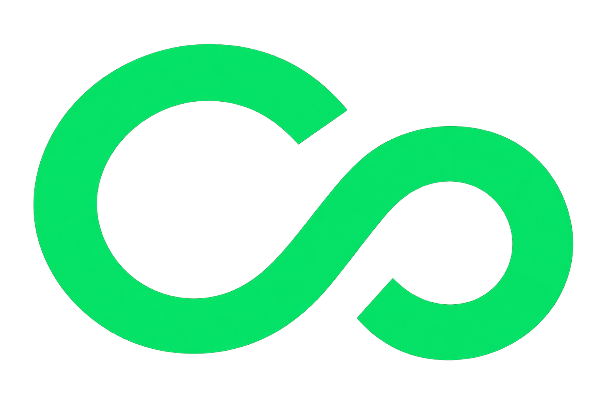

# Co-Founder

### AI Co-Founder Platform · v0.9.22

  A full-stack multi-agent platform that acts as an early founding team.
   
  Chat with a CEO orchestrator and delegate work to specialist AI agents.

 

<a href="https://get-cofounder.tech/">
  <strong>🚀 TRY CO-FOUNDER — LIVE DEMO</strong>
</a>

  

<a href="https://get-cofounder.tech/">
  https://get-cofounder.tech/
</a>

---

## Overview

AI Co-Founder simulates a startup team around a CEO agent. A founder describes the business through chat; the CEO decides whether to answer directly, ask a clarification question, retrieve company knowledge, or delegate to a specialist.

This release includes the Dockerized stack, effort-based routing (Flash / Mid / Max), real-time streaming with buffered WebSocket observability, Google + email auth, live Razorpay billing, encrypted connector credentials, and a connected-apps tool manager that lets agents read from and act in third-party tools.

Key highlights:
- **CEO orchestration** — one LangChain agent routes across 8 tools to specialist sub-agents, with MCQ clarifications and LLM-as-judge refinement.
- **Company knowledge** — RAG over uploaded docs (semantic + keyword fusion) plus separate chat-memory retrieval.
- **Connected apps** — a small MCP-style tool registry (`connections/tool_manager.py`) exposes each integration to agents as LangChain tools, with the company injected server-side. Agents can read and draft in Gmail, read/write Google Sheets, search/read/download/upload Google Drive files, read the calendar, find free slots and book meetings on request, and publish a generated graphic to Instagram after the founder approves it.
- **Responsive chat accounting** — chat titles get an immediate provisional value while the polished title is generated in the background; credit deductions run synchronously before the response when possible, and per-message/session usage appears in the chat UI.
- **Connector security** — Google and Instagram credentials are encrypted at rest with `TOKEN_ENCRYPTION_KEY`; plaintext legacy rows remain readable and are resealed on their next write.
- **Live observability** — token-by-token streaming and agent trace timeline in chat, with buffered replay so traces never go missing.
- **Real billing** — Razorpay Checkout, HMAC verification, idempotent credit top-ups (1 credit = ₹1), invoice history.
- **Guided onboarding** — a six-step spotlight product tour runs once for new accounts and is replayable from the profile menu.
- **Evaluated** — RAG 95.00% pass rate; CEO e2e: 27 runs / 81 judge verdicts (see `docs/eval_report.md`).

## Architecture

## Tech Stack

| Layer | Technology |
|---|---|
| Orchestration | Python 3.13+, LangChain (`create_agent` factory) |
| Backend | FastAPI, Uvicorn |
| Caching | Redis |
| Message Bus | Apache Kafka (KRaft) |
| Vector Search | Supabase pgvector (HNSW) |
| LLM Provider | OpenRouter (DeepSeek, GLM, GPT-OSS, Gemma) |
| Web Search | Tavily |
| Market Data | SerpAPI (Trends, News, Shopping) |
| Code Sandbox | e2b |
| Database / Storage | Supabase Postgres + Storage |
| Payments | Razorpay Standard Checkout |
| Frontend | Next.js 16, React 19, Tailwind CSS v4, Three.js / GSAP / framer-motion |

## Docs

| File | What it covers |
|---|---|
| [`docs/technical.md`](docs/technical.md) | Full technical details — agents, RAG, backend, billing, frontend, observability, benchmarks |
| [`docs/Agents_rules.md`](docs/Agents_rules.md) | Agent cooperation rules — CEO ownership, delegation contract, system prompts |
| [`docs/release_notes.md`](docs/release_notes.md) | Version changelog — what changed in each release |
| [`docs/eval_report.md`](docs/eval_report.md) | CEO agent e2e evaluation — 27 runs, 81 judge verdicts, findings |
| [`docs/video.md`](docs/video.md) | Product film — how the 60s marketing video is generated from code with Remotion |

## Status

Functional end-to-end production test (v0.9.22) — chat loop, multi-agent system, RAG, billing, auth, plugins, Google connected apps, encrypted credentials, connected-app publishing, Drive branding, and OAuth integrations are operational. Known gaps (slow image gen, Supabase free-tier latency, and Google verification for broad Drive scopes) are tracked in [`docs/technical.md`](docs/technical.md#status).

## License

Copyright (C) 2026 Karthikeya Kumar

Licensed under GNU Affero General Public License v3.0 (AGPL-3.0). See LICENSE for details.
